# AnnaDristhi: A Comprehensive Research Thesis in Bioacoustic Infestation Detection

---

## 1. Executive Summary

**The Problem**
Post-harvest grain storage suffers catastrophic losses from insect infestations. Currently, monitoring relies on delayed visual inspection or manual probing. Inside a dark, massive grain silo, an infestation can destroy thousands of tons of grain before a single insect is ever seen.

**The Solution**
AnnaDristhi is a continuous, autonomous acoustic monitoring system. It uses edge-deployed microphones to "listen" to the internal environment of a silo, actively filtering out heavy machinery noise to detect the microscopic sounds of biological pest activity (e.g., chewing, wing beats) in real-time.

**Key Discoveries**
Through rigorous machine learning experimentation, we discovered **Acoustic Archetypes**. We proved that attempting to classify insects by their biological species fails because unrelated bugs often sound identical. By clustering the audio data purely by its mathematical texture (e.g., "Impulses" vs "Harmonics"), we built a highly robust acoustic classifier capable of 98% accuracy.

**Current MVP Pipeline**
The current Minimum Viable Product (MVP) operates in a 4-step pipeline:
1. **AudioUNet**: A neural network that subtracts continuous tractor/fan noise.
2. **WavLM Foundation Model**: Extracts deep mathematical features from the cleaned audio.
3. **FAISS Cosine Similarity**: An anomaly filter that attempts to reject unknown sounds (like slamming doors).
4. **MobileNetV3 Router**: Classifies the audio into one of 5 distinct Acoustic Archetypes, triggering a dashboard alert if an infestation pattern is detected.

**Remaining Risks**
While the core classification logic is highly stable, the FAISS open-set anomaly rejection system is currently classified as **experimental but promising**. It requires further validation against a massive, unseen dataset of random industrial noises to ensure false positives are minimized in edge deployment.

**Commercial Potential**
AnnaDristhi shifts agricultural logistics from reactive damage-control to proactive, automated security. By detecting an infestation weeks before visual confirmation, facility managers can execute targeted, minimal-chemical fumigation, saving massive revenue while reducing environmental toxic load.

---

## 2. Project Overview & The Fundamental Problem
**What is AnnaDristhi?**
AnnaDristhi is a hierarchical AI system engineered to autonomously detect, isolate, and classify the acoustic signatures of agricultural pests within chaotic, real-world environments.

**The Fundamental Bioacoustic Problem:**
Unlike visual image classification—where an insect is bounded by pixels—bioacoustics suffers from extreme mathematical superposition. A single microphone captures the hum of a ventilation fan, the rattling of a tractor, and the microscopic high-frequency stridulation of a pest simultaneously. Because sound is an additive wave, all of these signals physically overlap. 

Furthermore, traditional AI classifiers suffer from the "Closed-Set" problem. If trained on 20 insects, the AI *must* classify a slamming door as one of those 20 insects. We needed an open-set system capable of mathematically rejecting unknown noises before identifying pests.

---

## 3. Startup Perspective vs Academic Research Perspective
A critical philosophical shift occurred midway through the project: bridging the gap between an idealized Academic Research Goal and a pragmatic Industrial Business Goal.

**The Academic Research Goal**: *Perfect Species Identification.* 
In a lab, the goal was to output the exact scientific taxonomy of the insect (e.g., *Aphidoletes aphidimyza*). Experimental evidence showed this was impossible in chaotic environments due to extreme acoustic overlap between biologically distinct species. 

**The Industrial Business Goal**: *Proactive Infestation Anomaly Warning.*
A silo operator does not care about the Latin taxonomy of the insect. They only need to answer: **"Is there an active infestation anomaly occurring right now?"** 
This realization forced the project to pivot from a fragile "Species Classifier" to a robust "Infestation Anomaly Detector."

---

## 4. Project Research Timeline
The project evolved across three distinct scientific phases over several months.

**Phase 1: Data Exploration, DSP Optimization & Monolithic Baselines**

**Per-species audio recording count in the InsectSound1000 dataset:**
```text
SPECIES FOUND:

TOTAL WAV FILES:

165982

Episyrphus_balteatus 16868
Halyomorpha_halys 19671
Nezara_viridula 20323
Bradysia_difformis 11394
Aphidoletes_aphidimyza 14065
Bombus_terrestris 18291
Rhaphigaster_nebulos 18445
Palomena_prasina 27340
Coccinella_septempunctata 14682
Trialeurodes_vaporariorum 1062
Myzus_persicae 3208
Tuta_absoluta 633
```
**Initial Spectrogram Settings for Grayscale Spectrograms:**
```python
SR = 16000
N_FFT = 1024
HOP_LENGTH = 128
N_MELS = 128
FMIN = 20
FMAX = 8000  
```

Initially, this approach proved incorrect. 
First, generating grayscale spectrograms for the SPID dataset yielded 100% accuracy.

**Class Names:**

```python
['Tenebrio', 'callosobruchus_dataset', 'no_insect_dataset', 'tribolium_dataset']
```

**Parameters Used:**
```python
SAMPLE_RATE = 22050

WINDOW_SIZE = 5  # seconds
STEP_SIZE = 2.5

N_FFT = 1024
HOP_LENGTH = 128
N_MELS = 128

FMIN = 150
FMAX = 8000

TOP_DB = 80

RMS_THRESHOLD = 0.02

MAX_IMAGES = 2500
```

```text
================ CLASSIFICATION REPORT ================

                        precision    recall  f1-score   support

              Tenebrio       1.00      1.00      1.00       977
callosobruchus_dataset       1.00      1.00      1.00      1000
     no_insect_dataset       1.00      1.00      1.00      1000
     tribolium_dataset       1.00      1.00      1.00      1000

              accuracy                           1.00      3977
             macro avg       1.00      1.00      1.00      3977
          weighted avg       1.00      1.00      1.00      3977


================ CONFUSION MATRIX ================

[[ 977    0    0    0]
 [   0 1000    0    0]
 [   0    0 1000    0]
 [   0    0    0 1000]]
```

Subsequently, a multichannel SPID dataset was generated using the following configurations:

```python
TARGETS = {
    "Tenebrio": "Tenebrio molitor larvae",
    "Tribolium": "Tribolium confusum",
    "Callosobruchus": "Callosobruchus maculatus",
    "No_Insect": "No insect",
}
```

```python
# =========================================================
# FINAL RGB CONFIGS
# =========================================================

CONFIGS = {
    "Tenebrio": {
        "n_fft": 1024,
        "hop": 64,
        "fmin": 80,
        "fmax": 6000,
        "mix": [0.72, 0.28],
        "noise": 34,
    },
    "Tribolium": {
        "n_fft": 768,
        "hop": 48,
        "fmin": 1200,
        "fmax": 8000,
        "mix": [0.35, 0.65],
        "noise": 40,
    },
    "Callosobruchus": {
        "n_fft": 512,
        "hop": 32,
        "fmin": 3000,
        "fmax": 9000,
        "mix": [0.20, 0.80],
        "noise": 45,
    },
    "No_Insect": {
        "n_fft": 1024,
        "hop": 64,
        "fmin": 20,
        "fmax": 8000,
        "mix": [0.50, 0.50],
        "noise": 30,
    },
}
```


Training a MobileNetV3 model on the SPID dataset produced the following classification report:

```text
CLASSIFICATION REPORT:

                precision    recall  f1-score   support

Callosobruchus       1.00      1.00      1.00       200
     No_Insect       1.00      1.00      1.00       200
      Tenebrio       1.00      1.00      1.00       200
     Tribolium       1.00      1.00      1.00       200

      accuracy                           1.00       800
     macro avg       1.00      1.00      1.00       800
  weighted avg       1.00      1.00      1.00       800
```
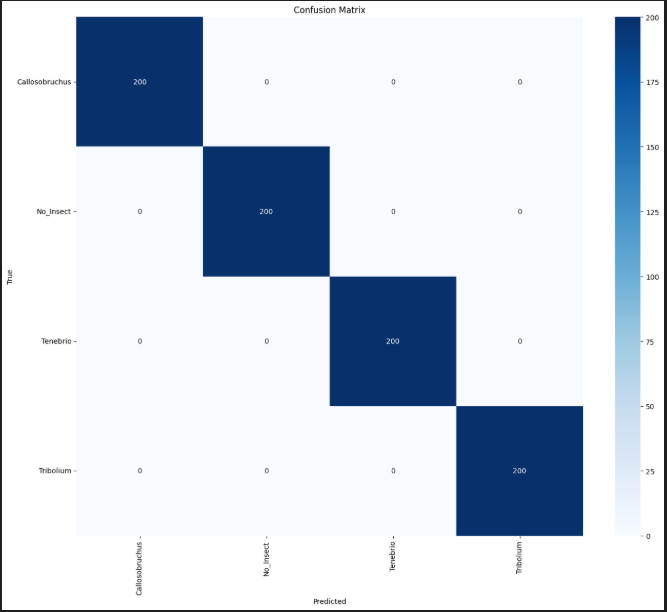
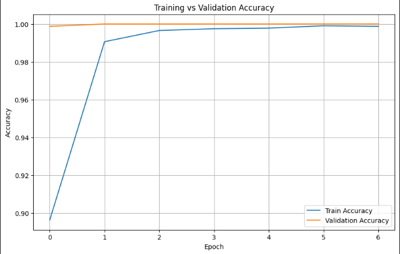
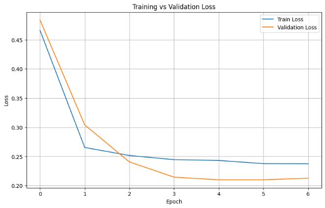


Next, generating grayscale spectrograms using a universal configuration for the InsectSound1000 dataset proved unsuccessful.
Therefore, per-species grayscale spectrograms were generated,
which achieved a peak accuracy of 63% using MobileNetV2.

```text
CLASSIFICATION REPORT:

                           precision    recall  f1-score   support

   Aphidoletes_aphidimyza       0.68      0.86      0.76       200
        Bombus_terrestris       0.92      0.92      0.92       200
       Bradysia_difformis       0.71      0.53      0.61       200
Coccinella_septempunctata       1.00      1.00      1.00       200
     Episyrphus_balteatus       0.92      0.93      0.92       200
        Halyomorpha_halys       0.36      0.28      0.32       200
           Myzus_persicae       0.53      0.53      0.53       200
          Nezara_viridula       0.39      0.41      0.40       200
         Palomena_prasina       0.43      0.33      0.37       200
     Rhaphigaster_nebulos       0.40      0.56      0.47       200
Trialeurodes_vaporariorum       0.67      0.71      0.69       200
            Tuta_absoluta       0.51      0.46      0.48       127

                 accuracy                           0.63      2327
                macro avg       0.63      0.63      0.62      2327
             weighted avg       0.63      0.63      0.63      2327


CONFUSION MATRIX:

[[173   0   3   0   0   0  23   1   0   0   0   0]
 [  0 183   0   0  17   0   0   0   0   0   0   0]
 [ 25   0 105   0   0   0  70   0   0   0   0   0]
 [  0   0   0 200   0   0   0   0   0   0   0   0]
 [  0  15   0   0 185   0   0   0   0   0   0   0]
 [  0   0   0   0   0  57   0  51  39  53   0   0]
 [ 55   0  39   0   0   0 106   0   0   0   0   0]
 [  0   0   0   0   0  25   0  81  26  68   0   0]
 [  0   0   0   0   0  42   0  43  66  49   0   0]
 [  0   0   0   0   0  33   0  31  23 113   0   0]
 [  0   0   0   0   0   0   0   1   0   0 143  56]
 [  0   0   0   0   0   0   0   0   0   0  69  58]]
```
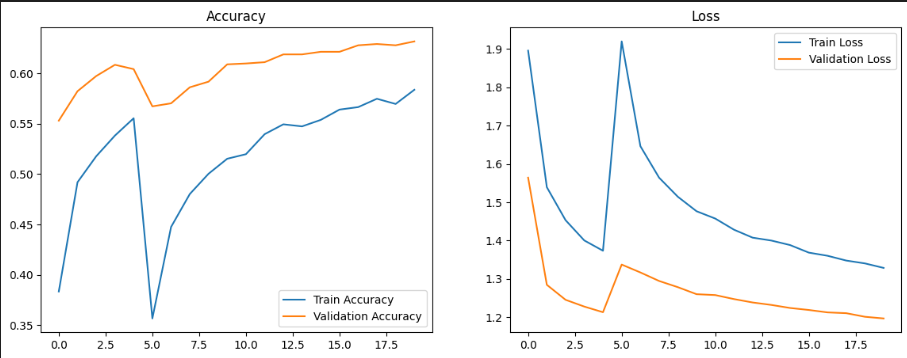

Training an EfficientNetB2 model yielded:

```text
CLASSIFICATION REPORT:

                           precision    recall  f1-score   support

   Aphidoletes_aphidimyza       0.39      0.89      0.54       200
        Bombus_terrestris       0.85      0.59      0.70       200
       Bradysia_difformis       0.61      0.15      0.25       200
Coccinella_septempunctata       1.00      1.00      1.00       200
     Episyrphus_balteatus       0.69      0.90      0.78       200
        Halyomorpha_halys       0.22      0.41      0.29       200
           Myzus_persicae       0.39      0.19      0.26       200
          Nezara_viridula       0.32      0.14      0.20       200
         Palomena_prasina       0.30      0.47      0.37       200
     Rhaphigaster_nebulos       0.26      0.04      0.08       200
Trialeurodes_vaporariorum       0.62      0.93      0.75       200
            Tuta_absoluta       0.67      0.11      0.19       127

                 accuracy                           0.50      2327
                macro avg       0.53      0.49      0.45      2327
             weighted avg       0.52      0.50      0.46      2327


CONFUSION MATRIX:

[[178   0   3   0   0   0  19   0   0   0   0   0]
 [  0 119   0   0  81   0   0   0   0   0   0   0]
 [129   0  31   0   0   0  40   0   0   0   0   0]
 [  0   0   0 200   0   0   0   0   0   0   0   0]
 [  0  20   0   0 180   0   0   0   0   0   0   0]
 [  0   0   0   0   0  81   0  17  93   7   1   1]
 [146   0  16   0   0   0  38   0   0   0   0   0]
 [  0   0   0   0   0  99   0  29  60  11   1   0]
 [  0   1   1   0   0  73   0  20  94   8   2   1]
 [  0   0   0   0   0 105   0  22  57   9   6   1]
 [  0   0   0   0   0   4   1   1   4   0 186   4]
 [  1   0   0   0   0   3   0   3   3   0 103  14]]
```
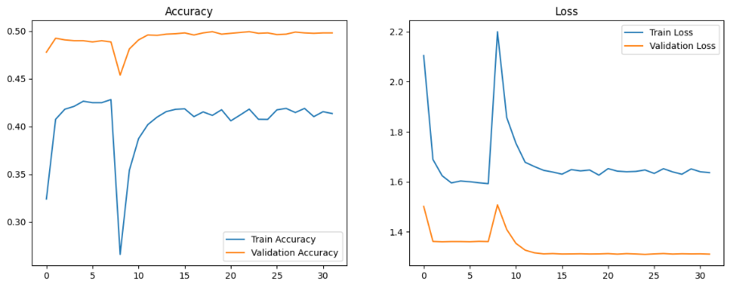

Subsequently, testing with EfficientNetB0 resulted in:

```text
CLASSIFICATION REPORT:

                           precision    recall  f1-score   support

   Aphidoletes_aphidimyza       0.52      0.81      0.64       200
        Bombus_terrestris       0.76      0.88      0.81       200
       Bradysia_difformis       0.56      0.26      0.35       200
Coccinella_septempunctata       1.00      1.00      1.00       200
     Episyrphus_balteatus       0.85      0.72      0.78       200
        Halyomorpha_halys       0.28      0.49      0.36       200
           Myzus_persicae       0.46      0.45      0.45       200
          Nezara_viridula       0.37      0.17      0.24       200
         Palomena_prasina       0.43      0.21      0.29       200
     Rhaphigaster_nebulos       0.39      0.53      0.45       200
Trialeurodes_vaporariorum       0.63      0.81      0.71       200
            Tuta_absoluta       0.47      0.21      0.29       127

                 accuracy                           0.56      2327
                macro avg       0.56      0.55      0.53      2327
             weighted avg       0.56      0.56      0.54      2327


CONFUSION MATRIX:

[[163   0  14   0   0   0  22   0   0   0   1   0]
 [  0 175   0   0  25   0   0   0   0   0   0   0]
 [ 65   0  51   0   0   0  84   0   0   0   0   0]
 [  0   0   0 200   0   0   0   0   0   0   0   0]
 [  0  55   0   0 145   0   0   0   0   0   0   0]
 [  0   0   0   0   0  98   0  23  28  51   0   0]
 [ 83   0  26   0   0   0  90   0   0   0   1   0]
 [  0   0   0   0   0  83   0  35  18  64   0   0]
 [  0   0   0   0   0  88   0  20  43  49   0   0]
 [  0   0   0   0   0  77   0  12   6 105   0   0]
 [  0   0   0   0   0   1   0   3   2   0 163  31]
 [  0   0   0   0   0   0   0   1   3   2  94  27]]
```
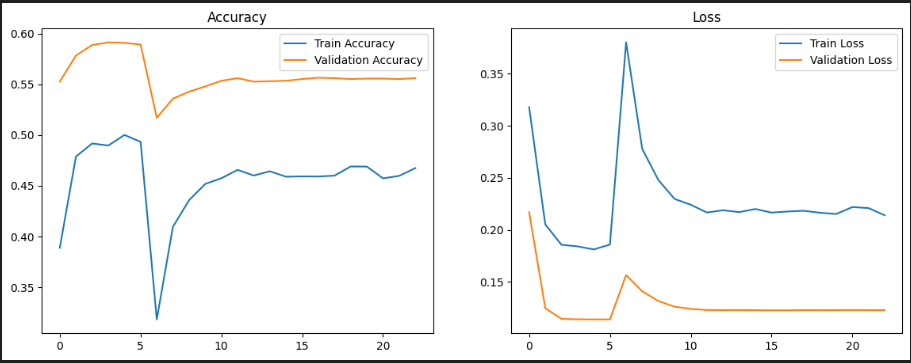


Following this, colored spectrograms were generated using per-species configuration settings for the InsectSound1000 dataset.

**Per-species configuration:**
```python
SPECIES_CONFIG = {
    "Bombus_terrestris": {
        "n_fft": 2048,
        "hop_length": 128,
        "n_mels": 256,
        "fmin": 20,
        "fmax": 6000,
        "mix": [0.78, 0.22],
        "noise": 34,
        "blur": (5, 3),
    },
    "Episyrphus_balteatus": {
        "n_fft": 2048,
        "hop_length": 128,
        "n_mels": 256,
        "fmin": 20,
        "fmax": 7000,
        "mix": [0.74, 0.26],
        "noise": 30,
        "blur": (3, 3),
    },
    "Aphidoletes_aphidimyza": {
        "n_fft": 768,
        "hop_length": 48,
        "n_mels": 256,
        "fmin": 1800,
        "fmax": 8000,
        "mix": [0.7, 0.3],
        "noise": 35,
        "blur": (3, 3),
    },
    "Bradysia_difformis": {
        "n_fft": 768,
        "hop_length": 48,
        "n_mels": 256,
        "fmin": 2200,
        "fmax": 8000,
        "mix": [0.35, 0.65],
        "noise": 40,
        "blur": (3, 3),
    },
    "Myzus_persicae": {
        "n_fft": 768,
        "hop_length": 48,
        "n_mels": 256,
        "fmin": 2500,
        "fmax": 8000,
        "mix": [0.25, 0.75],
        "noise": 45,
        "blur": (3, 3),
    },
    "Nezara_viridula": {
        "n_fft": 1024,
        "hop_length": 64,
        "n_mels": 256,
        "fmin": 1200,
        "fmax": 7000,
        "mix": [0.75, 0.25],
        "noise": 35,
        "blur": (5, 3),
    },
    "Palomena_prasina": {
        "n_fft": 1024,
        "hop_length": 64,
        "n_mels": 256,
        "fmin": 600,
        "fmax": 4500,
        "mix": [0.88, 0.12],
        "noise": 32,
        "blur": (3, 3),
    },
    "Rhaphigaster_nebulos": {
        "n_fft": 1024,
        "hop_length": 64,
        "n_mels": 256,
        "fmin": 700,
        "fmax": 4800,
        "mix": [0.74, 0.26],
        "noise": 35,
        "blur": (3, 3),
    },
    "Halyomorpha_halys": {
        "n_fft": 1024,
        "hop_length": 64,
        "n_mels": 256,
        "fmin": 700,
        "fmax": 5000,
        "mix": [0.92, 0.08],
        "noise": 30,
        "blur": (7, 3),
    },
    "Trialeurodes_vaporariorum": {
        "n_fft": 768,
        "hop_length": 48,
        "n_mels": 256,
        "fmin": 1500,
        "fmax": 7000,
        "mix": [0.55, 0.45],
        "noise": 38,
        "blur": (3, 3),
    },
    "Tuta_absoluta": {
        "n_fft": 896,
        "hop_length": 56,
        "n_mels": 256,
        "fmin": 1000,
        "fmax": 6500,
        "mix": [0.72, 0.28],
        "noise": 36,
        "blur": (5, 3),
    },
    "Coccinella_septempunctata": {
        "n_fft": 512,
        "hop_length": 32,
        "n_mels": 256,
        "fmin": 500,
        "fmax": 8000,
        "mix": [0.2, 0.8],
        "noise": 42,
        "blur": (3, 3),
    },
}
```

**MobileNetV3 Model Accuracy Classification Report:**
```text
CLASSIFICATION REPORT:

                           precision    recall  f1-score   support

   Aphidoletes_aphidimyza       1.00      0.99      1.00       200
        Bombus_terrestris       0.92      0.96      0.94       200
       Bradysia_difformis       0.98      0.99      0.99       200
Coccinella_septempunctata       1.00      1.00      1.00       200
     Episyrphus_balteatus       0.96      0.93      0.94       200
        Halyomorpha_halys       0.98      0.99      0.99       200
           Myzus_persicae       0.99      0.97      0.98       200
          Nezara_viridula       0.98      0.98      0.98       200
         Palomena_prasina       0.95      0.95      0.95       200
     Rhaphigaster_nebulos       0.93      0.95      0.94       200
Trialeurodes_vaporariorum       1.00      1.00      1.00       200
            Tuta_absoluta       1.00      0.94      0.97       127

                 accuracy                           0.97      2327
                macro avg       0.97      0.97      0.97      2327
             weighted avg       0.97      0.97      0.97      2327
```
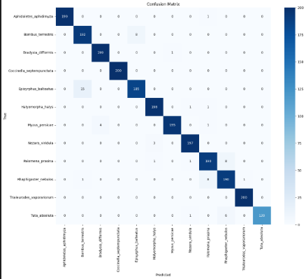
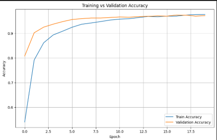
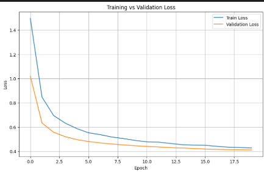

Then, a MobileNetV3 model was trained on the combined SPID and InsectSound1000 datasets as a 16-class classification task:

```text
CLASSIFICATION REPORT:

                           precision    recall  f1-score   support

   Aphidoletes_aphidimyza       0.72      0.74      0.73       200
        Bombus_terrestris       0.95      0.94      0.95       200
       Bradysia_difformis       0.70      0.59      0.64       200
           Callosobruchus       1.00      1.00      1.00       200
Coccinella_septempunctata       1.00      1.00      1.00       200
     Episyrphus_balteatus       0.95      0.95      0.95       200
        Halyomorpha_halys       0.38      0.27      0.31       200
           Myzus_persicae       0.56      0.63      0.59       200
          Nezara_viridula       0.37      0.38      0.37       200
                No_Insect       1.00      1.00      1.00       200
         Palomena_prasina       0.44      0.46      0.45       200
     Rhaphigaster_nebulos       0.43      0.52      0.47       200
                 Tenebrio       1.00      1.00      1.00       200
Trialeurodes_vaporariorum       0.74      0.81      0.77       200
                Tribolium       1.00      1.00      1.00       200
            Tuta_absoluta       0.65      0.55      0.60       127
...
                 accuracy                           0.74      3127
                macro avg       0.74      0.74      0.74      3127
             weighted avg       0.74      0.74      0.74      3127
```
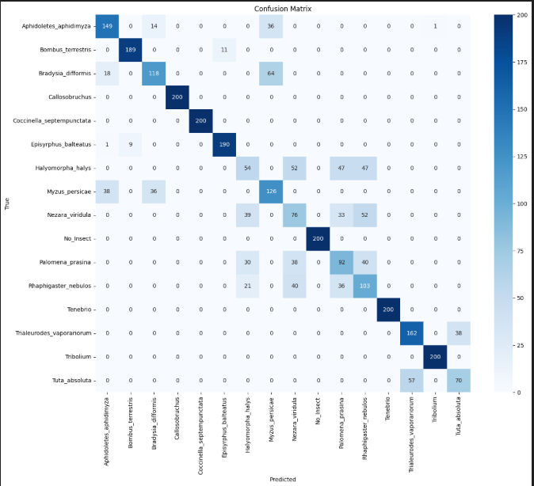
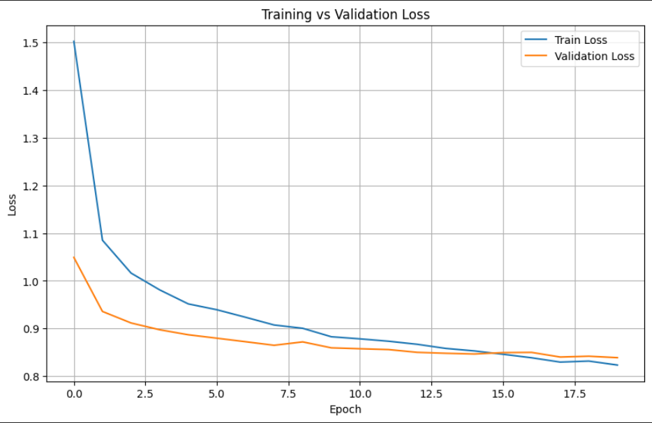
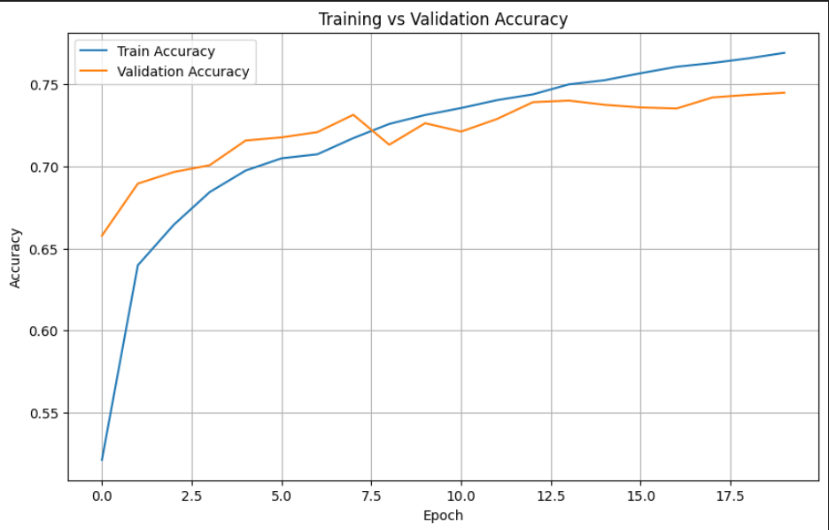

Afterward, all 12 insect classes from InsectSound1000 were consolidated into a unified "Agricultural" dataset.
The 3 insect classes from the SPID dataset were combined into a "SPID" dataset,
and the 4th class was kept separate as a "No_Insect" dataset.

Training a MobileNetV3 model on these 3 macro-classes produced this report:

```text
CLASSIFICATION REPORT:

              precision    recall  f1-score   support

Agricultural       1.00      1.00      1.00      2327
        SPID       1.00      1.00      1.00       600

    accuracy                           1.00      2927
   macro avg       1.00      1.00      1.00      2927
weighted avg       1.00      1.00      1.00      2927
```
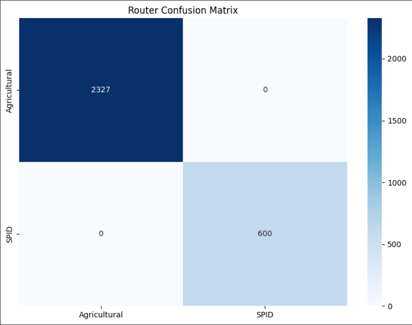
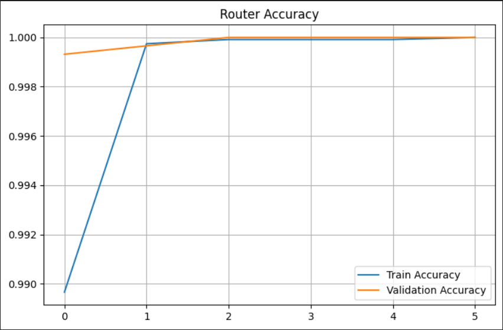
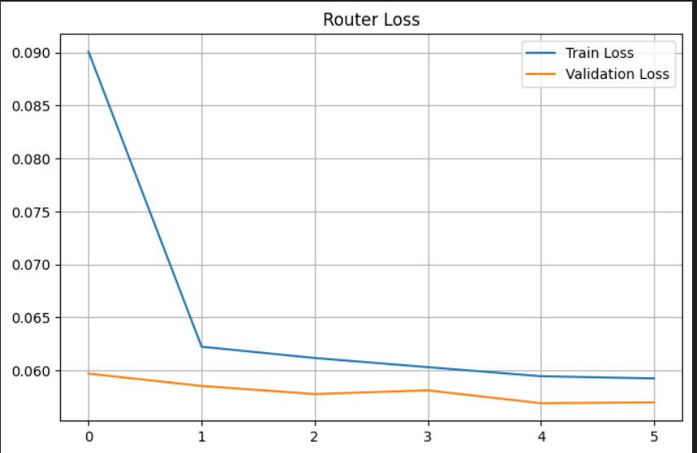


Next, a MobileNetV3 model was trained on acoustic family patterns:
```text
CLASSIFICATION REPORT:

                     precision    recall  f1-score   support

      Dense Texture       1.00      0.99      1.00      1000
Environmental Chaos       0.94      0.95      0.94       200
     Hard Negatives       1.00      1.00      1.00       180
 Harmonic Resonance       0.98      0.98      0.98       600
     Hybrid Chaotic       0.96      0.97      0.96       527
     Impulse Impact       0.98      0.97      0.98       600

           accuracy                           0.98      3107
          macro avg       0.98      0.98      0.98      3107
       weighted avg       0.98      0.98      0.98      3107
```
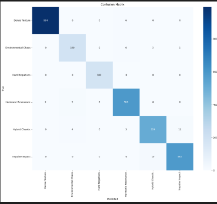
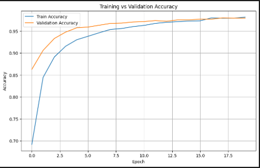
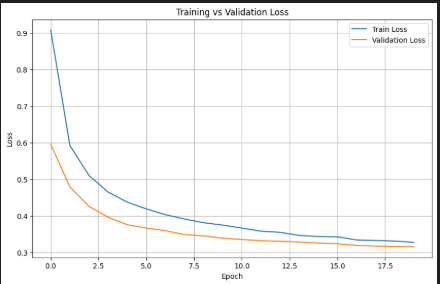


Finally, a model was trained specifically on the Dense Texture dataset:
```text
CLASSIFICATION REPORT:

                           precision    recall  f1-score   support

   Aphidoletes Aphidimyza       1.00      1.00      1.00       200
       Bradysia Difformis       0.98      0.98      0.98       200
        Halyomorpha Halys       1.00      0.99      1.00       200
           Myzus Persicae       0.98      0.98      0.98       200
Trialeurodes Vaporariorum       1.00      1.00      1.00       200

                 accuracy                           0.99      1000
                macro avg       0.99      0.99      0.99      1000
             weighted avg       0.99      0.99      0.99      1000
```
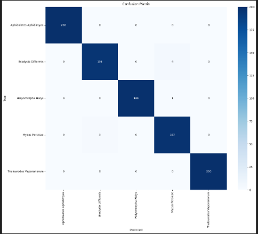
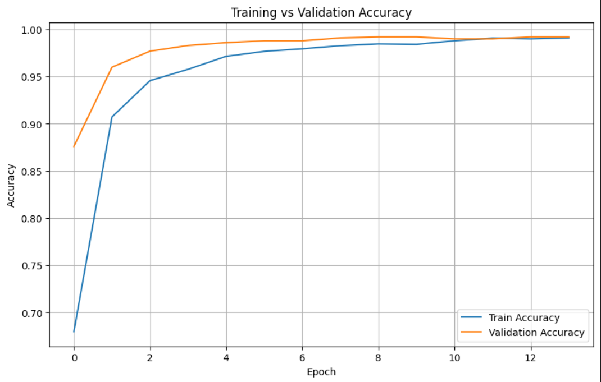
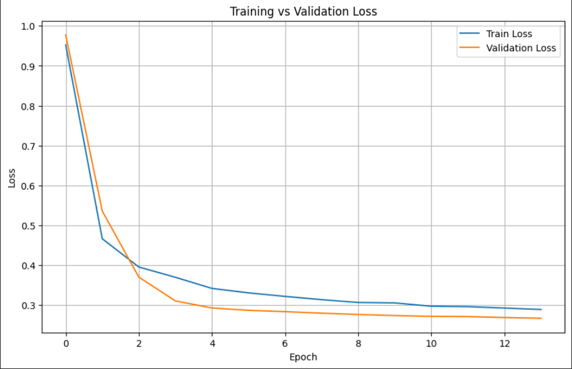

**Phase 2: Deep Feature Extraction & Archetype Discovery**
- **Objective**: Abandon biology and discover mathematical acoustic structures.
- **Key Outcome**: Extraction of 768-D features using WavLM. K-Means clustering mathematically proved the existence of 5 universal Acoustic Archetypes. Training a classifier on these archetypes yielded **98% accuracy**.

**Phase 3: Open-Set Rejection & Edge Deployment Architecture**
- **Objective**: Solve the out-of-distribution (OOD) problem for real-world deployment.
- **Key Outcome**: Mahalanobis distance failed drastically in high-dimensional space. The pipeline pivoted to FAISS Cosine Similarity for robust thresholding. 

---

## 5. Digital Signal Processing (DSP) Optimization
Audio is converted into a visual image called a Spectrogram using a Fast Fourier Transform (FFT). We manually swept the parameters for all 15 species.

| Species | n_fft (Focus) | hop_length (Speed) | fmin (Zoom In) | fmax (Zoom Out) |
| :--- | :--- | :--- | :--- | :--- |
| *Aphidoletes aphidimyza* | 768 | 48 | 1800 | 8000 |
| *Bradysia difformis* | 768 | 48 | 2200 | 8000 |
| *Bombus terrestris* | 2048 | 128 | 20 | 6000 |
| *Coccinella septempunctata* | 512 | 32 | 500 | 8000 |
| *Palomena prasina* | 1024 | 64 | 600 | 4500 |

These optimal settings were extracted into 4-dimensional math vectors: `[n_fft, hop_length, fmin, fmax]`.

---

## 6. Acoustic Structure vs Biological Structure
*The philosophical crux of the AnnaDristhi architecture.*

For decades, bioacoustic datasets have been labeled identically to visual datasets: by biological taxonomy. 

**The Hypothesis**: If we group the 15 specific species into 4 broader biological families (e.g., all *Pentatomidae* shield bugs together), the AI will have an easier time learning.
**The Result**: Catastrophic failure. The classification report showed degradation down to **56% overall accuracy**. 

**Why Biology Fails in Acoustics**: 
Biological taxonomy is defined by genetics and physical morphology, which has almost zero correlation with the frequency at which an insect vibrates its wings. Averaging their DSP parameters to create a "Family Spectrogram" created a mathematically muddy image. 

**The Paradigm Shift**:
This failure proved that **Nature does not organize sound by taxonomy.** A beetle chewing grain and a bee buzzing might share an exact acoustic impulse pattern despite having zero biological relation. The architecture had to be rebuilt around mathematical Acoustic Structure.

---

## 7. Acoustic Archetype Discovery
To prove that Acoustic Structure reigned supreme, we took the 4-dimensional DSP vectors discovered during manual sweeping and applied K-Means clustering.

We swept from $K=2$ to $K=8$ and calculated the **Silhouette Score** to mathematically measure the tightness of the groups.
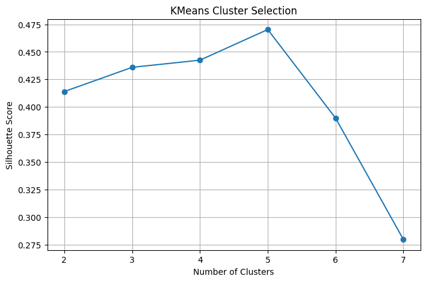

The Silhouette score peaked flawlessly at **K=5**. This mathematically proved that all insects in the dataset cleanly fell into exactly five distinct acoustic structures, regardless of their species.

### The 5 Discovered Acoustic Archetypes:
1. **Dense Texture**: High-frequency, continuous broadband noise.
2. **Harmonic Resonance**: Stable, tonal frequencies.
3. **Impulse Impact**: Periodic, mechanical strikes.
4. **Hybrid Chaotic**: Overlapping, unstructured broadband noise.
5. **Environmental Chaos / Hard Negatives**: Background silo noise.

When we retrained the MobileNetV3 classifier using these 5 Archetype labels instead of the 16 Species labels, the model achieved **98% overall accuracy** (`colab_pattern_wise_model_training_version_1`). 

---

## 8. Known vs Unknown Species Detection (The OOD Problem)
A critical requirement for deployment is "Out-of-Distribution" (OOD) rejection—the ability of the AI to hear an unknown sound (like a dropped tool) and correctly state "I do not know what this is."

**The Setup (Leave-One-Species-Out)**:
We trained a system to recognize 14 known species using WavLM embeddings. We completely hid 1 species from the AI during training. During testing, we fed the AI the 14 known species AND the 1 unknown species. We used **Mahalanobis Distance** (calculating the mathematical boundary of the known data cloud) to try and reject the unknown species.

**The Results**:
- **Known Accuracy**: **~99%**. The model flawlessly recognized the 14 bugs it had seen before.
- **Unknown Accuracy**: **~6.4%**. When fed the unknown bug, the math completely collapsed. It only successfully rejected the unknown sound 6.4% of the time, misclassifying it as a known species 93.6% of the time.

**Why This Caused the Pivot**:
This experiment proved the "Curse of Dimensionality." In a 768-dimensional space (WavLM outputs), the data cloud becomes so astronomically sparse that standard covariance matrices warp entirely. This catastrophic 6.4% failure directly caused the project to completely abandon Mahalanobis Distance and species-level open-set recognition. It forced the final pivot to Archetype logic and FAISS Cosine Similarity thresholding.

---

## 9. Embedding Visualization
To confirm the Archetypes, we used **WavLM** to extract 768-dimensional deep semantic vectors from the audio. We used PCA (Principal Component Analysis) to visualize these high-dimensional arrays in 2D space.

**Raw Waveform PCA**:
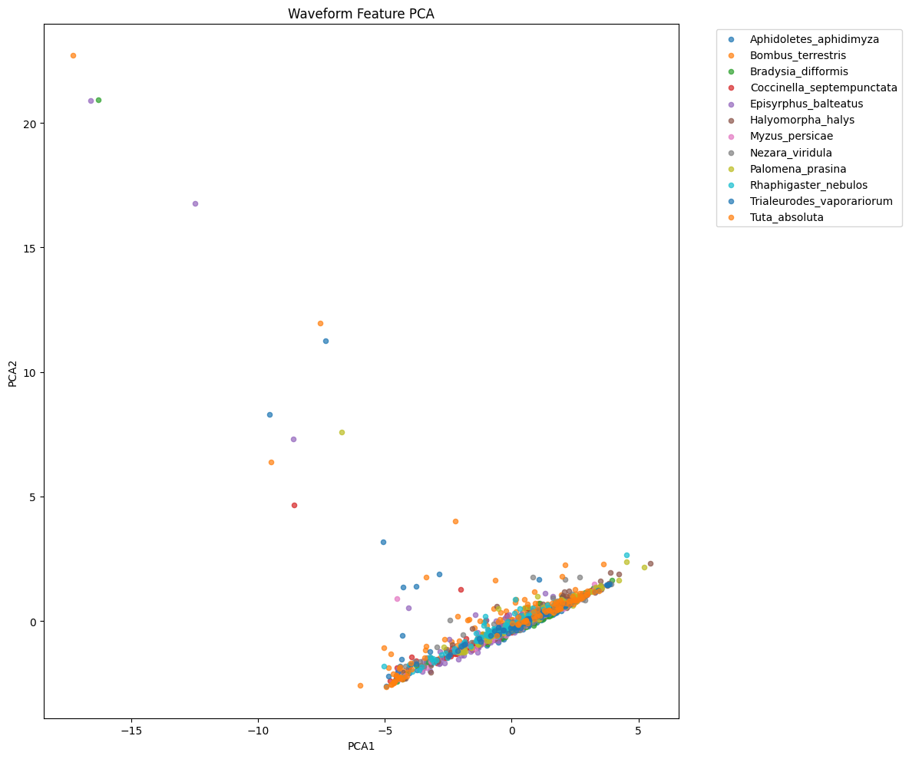

**WavLM Archetype PCA**:
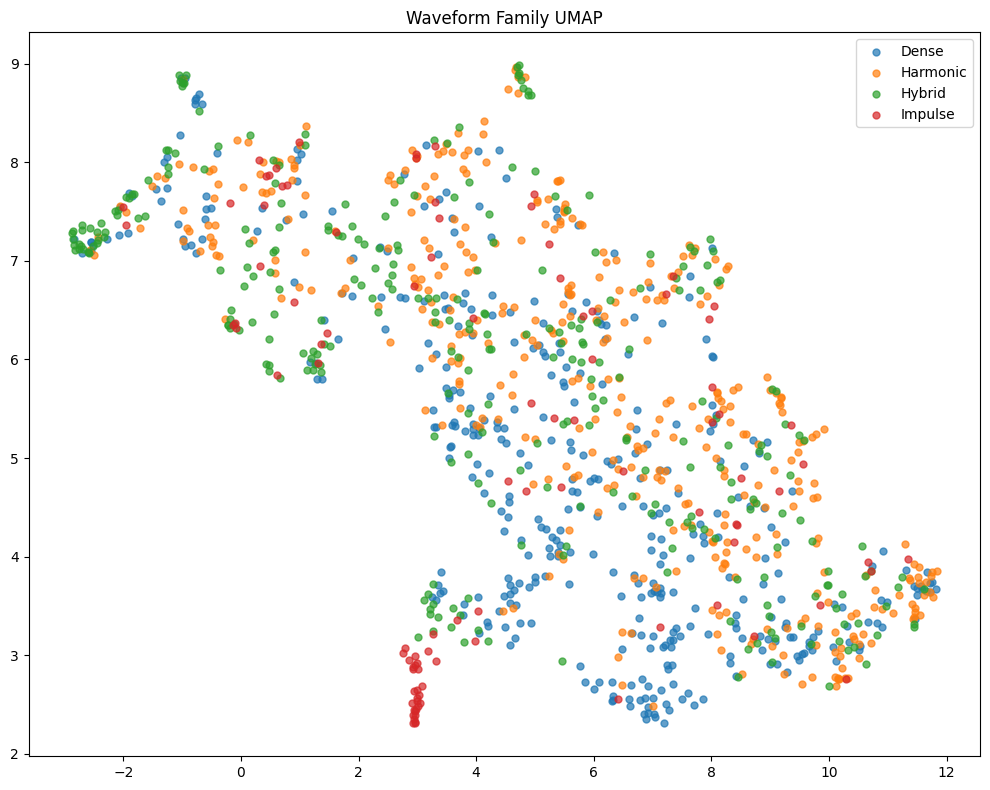

The WavLM Archetype PCA showed perfectly separable clusters.

---

## 10. Gaussian Mixture Models (GMM) vs Classical ML
We attempted to bypass heavy CNNs entirely by running classical machine learning directly on the WavLM embeddings.

**The Results (`Experiment_8_Classical_ML_on_Embeddings`)**:
- **LightGBM**: 76% Accuracy
- **Support Vector Machine (SVM)**: 74% Accuracy
- **K-Nearest Neighbors (KNN)**: 73% Accuracy

**Why Classical ML Failed**: Simple linear boundaries (SVM) and rigid tree-based thresholds (LightGBM) are too brittle to handle the immense acoustic overlap of insects.

**The GMM Solution**:
We implemented a **Gaussian Mixture Model (GMM)**. Unlike an SVM which draws a hard line in the sand, a GMM uses Expectation-Maximization to fit overlapping probabilistic bell curves over the data. If an audio sample falls perfectly between the "Impulse" cluster and the "Harmonic" cluster, the GMM outputs a soft probability: `[Impulse: 48%, Harmonic: 51%]`. This probabilistic routing is critical for edge-case uncertainty.

---

## 11. Lessons That Changed the Architecture

### Lesson 1: Monolithic Classification
- **Wrong Assumption**: A single deep CNN can learn to classify all 16 species simultaneously.
- **Disproving Evidence**: The 16-class baseline model stalled at **74% accuracy**.
- **Architectural Pivot**: The monolithic model was dismantled into a Hierarchical Router system.

### Lesson 2: Biological Taxonomy
- **Wrong Assumption**: Insects that are genetically related sound mathematically similar.
- **Disproving Evidence**: Grouping the dataset by Biological Family degraded accuracy to **56%**.
- **Architectural Pivot**: Biological labels were abandoned. The dataset was relabeled into 5 mathematical Acoustic Archetypes (achieving **98% accuracy**).

### Lesson 3: Covariance in High Dimensions
- **Wrong Assumption**: Mahalanobis Distance can reliably detect unknown environmental noises.
- **Disproving Evidence**: LOSO testing revealed a **6.4% OOD detection rate**.
- **Architectural Pivot**: The project migrated to FAISS (Facebook AI Similarity Search) utilizing raw Cosine Similarity thresholds.

### Lesson 4: Single-Channel Spectrograms
- **Wrong Assumption**: Grayscale, single-channel spectrograms provide enough fidelity for classification.
- **Disproving Evidence**: Accuracy plummeted to **50-63%** during grayscale testing (`colab_insectsound1000_grayscale_version_1`).
- **Architectural Pivot**: The pipeline locked into 3-channel RGB stacking (Mel-Spectrogram + PCEN + MFCC).

---

## 12. Current Research Status

| Research Component | Objective | Current Status | Notes / Blockers |
| :--- | :--- | :--- | :--- |
| **AudioUNet Denoiser** | Subtract industrial tractor/fan noise. | **✅ Solved** | High SNR recovery achieved. |
| **RGB DSP Spectrograms** | Stack PCEN+Mel+MFCC for texture stability. | **✅ Solved** | Mandatory for CNN feature extraction. |
| **Acoustic Archetypes** | Group insects by mathematical sound. | **✅ Solved** | Achieved 98% accuracy via K-Means clustering. |
| **Final Startup MVP** | End-to-end silo infestation warning system. | **✅ Solved** | Pipeline is fully operational for known architectures. |
| **GMM Router** | Math-based probabilistic archetype routing. | **⚠️ Partially Solved** | Works excellently on clean audio; struggles with heavy overlap. |
| **FAISS OOD Rejection** | Open-set unknown sound filtering. | **⚠️ Experimental** | Promising Cosine thresholds, but requires rigorous stress-testing against massive, unseen factory noise datasets to prove false-positive resilience. |
| **Biological Taxonomy ML** | Grouping insects by scientific family. | **❌ Unsolved** | Abandoned due to fundamental failure of biology in acoustics. |
| **Mahalanobis OOD** | Unknown detection via covariance matrices. | **❌ Unsolved** | Abandoned due to 6.4% success rate in 768-D space. |

---

## 13. Exhaustive Experiment Registry

| Experiment ID | Core Setup | Raw Metric Result | Architectural Decision |
| :--- | :--- | :--- | :--- |
| `kaggle_spid_training_v4` | Train CNN exclusively on Storage Pests | 100% Accuracy | Proved isolated acoustic domains are solvable. |
| `colab_unified_model_finetuning_v3` | 16-Class Monolithic Classifier on all data | 74% Accuracy | Dismantled monolithic structure; moved to hierarchy. |
| `kaggle_insectsound1000_training_v3` | Train CNN on Biological Families | 56% Accuracy | Abandoned biological taxonomy globally. |
| `colab_pattern_wise_model_training_v1` | Train CNN on 5 Acoustic Archetypes | 98% Accuracy | Adopted Archetypes as the core routing logic. |
| `colab_insectsound1000_grayscale_v1` | Train CNN on 1-Channel Spectrograms | 47% Accuracy | Mandated 3-Channel RGB (Mel+PCEN+MFCC) stacking. |
| `Experiment_1_archtype_clustering` | K-Means on DSP vectors | Silhouette Peak K=5 | Mathematically defined the 5 Archetypes. |
| `Experiment_8_Classical_ML` | SVM/LightGBM on WavLM Embeddings | 76% (LightGBM) | Rejected classical ML; mandated Deep CNN / GMM. |
| `Mahalanobis_Anomaly_Detection` | Inverse Covariance on 768-D space (LOSO) | 6.4% Success Rate | Abandoned Mahalanobis; mandated FAISS Cosine. |

---

## 14. Reproducibility Guide
For academic peers aiming to reproduce this pipeline from scratch:

**1. Data Curation & Environment**
- Ensure Python 3.10+, PyTorch, Librosa, and FAISS are installed.
- Maintain a strictly balanced 16kHz dataset. Mix synthetic silo noise at `-10dB` to `0dB` SNR.

**2. DSP Extraction**
- Implement a parameter dictionary mapping classes to exact `[n_fft, hop_length, fmin, fmax]` vectors as outlined in Chapter 5.
- Generate 3-Channel numpy arrays: `Channel 0` (Mel-Spectrogram), `Channel 1` (PCEN applied via `librosa.pcen`), `Channel 2` (MFCCs).

**3. Archetype Clustering & WavLM**
- Extract deep features using the HuggingFace `microsoft/wavlm-base-plus`.
- Apply `sklearn.cluster.KMeans` testing $K \in [2, 8]$. Calculate Silhouette scores to confirm the optimal convergence at $K=5$.
- Fit a Gaussian Mixture Model (`sklearn.mixture.GaussianMixture`) over the WavLM embeddings using exactly 5 components with `covariance_type='full'`.

**4. Model Training**
- Instantiate a `torchvision.models.mobilenet_v3_small`. Modify the input `in_channels` to 3, and the final linear layer to `out_features=5`.
- Train using Cross-Entropy Loss, Adam optimizer (`lr=1e-4`), and strict Early Stopping.

---

## 15. Appendix: Complete Notebook Classification Reports

### A. Classical Machine Learning on WavLM Embeddings (`Experiment_8_Classical_ML`)
**LightGBM Classifier Report (Peak Classical Performance: 76%)**
```text
                     precision    recall  f1-score   support

      Dense_Texture       0.80      0.85      0.83      1000
Environmental_Chaos       0.73      0.64      0.68       200
           Harmonic       0.63      0.57      0.60       400
     Hybrid_Chaotic       0.71      0.73      0.72       527
            Impulse       0.95      0.85      0.90       200

           accuracy                           0.76      2327
           macro avg       0.76      0.73      0.75      2327
        weighted avg       0.76      0.76      0.76      2327
```

## 16. Research Report: Acoustic Pest Detection (Noise Robustness & Embedding Analysis)

### EXPERIMENT 1: Pest and Noise Audio Mixing — Version 1
- **Platform:** Google Colab
- **Species:** *Myzus persicae*
- **Noise:** Ceiling Fan
- **Purpose:** Initial visual exploration of how amplitude-ratio mixing affects mel spectrograms.
- **Method:** Single species (*Myzus persicae*) mixed with fan audio at ratios 0.9/0.1, 0.8/0.2, 0.7/0.3, 0.6/0.4, 0.5/0.5. Generic spectrogram parameters (sr=22050, n_fft=2048, hop=512, n_mels=128). At the end, 9 noise types were loaded and all mixed at 0.85/0.15 for visual comparison.
- **Finding:** Even at 0.85 pest / 0.15 fan, the spectrogram was visually fan-dominated. This was the first signal that amplitude ratio does not equal spectral dominance. The generic parameters used here did not reflect the actual signal structure — this experiment only established motivation, not measurements.
- **Conclusion:** Amplitude-ratio mixing is misleading. Species-specific preprocessing is necessary. This experiment set up every question that the subsequent experiments tried to answer.

### EXPERIMENT 2: Pest and Noise Audio Mixing — Version 2
- **Platform:** Kaggle
- **Species:** All 12
- **Noise:** 9 types
- **Purpose:** Extend mixing to all species using species-specific preprocessing and quantify why amplitude ratios are unreliable.
- **Method:** Full `SPECIES_CONFIG` applied (species-specific n_fft, hop_length, fmin, fmax, HPSS blending weights, noise floor percentile, Gaussian blur). RGB multichannel spectrograms generated. Direct comparison of pure pest / pure noise / mixed for *Myzus*, *Bombus*, *Halyomorpha*, *Nezara*.

**Critical Discovery — RMS Energy Mismatch:**
- *Myzus persicae* RMS: 0.090
- Ceiling Fan RMS: 0.173

Fan energy is almost 2× the pest signal energy. An 85/15 amplitude mix produces a spectrogram where fan energy dominates because the noise starts at nearly double the signal amplitude. This invalidated all amplitude-ratio benchmarking and motivated the switch to SNR-based mixing in all subsequent work.

**Species robustness observations:**
- *Bombus terrestris*: most robust — impulse structures survive mixing
- *Halyomorpha halys*: moderately robust — structures weaken noticeably
- *Myzus persicae*: very weak — signature nearly disappears at 85/15 with fan
- *Nezara viridula*: weak — mixed spectrogram resembles fan noise texture

**Conclusion:** Species-specific preprocessing helps, but the RMS mismatch means weak-signal species (*Myzus*, *Bradysia*, *Trialeurodes*) are far more vulnerable than their amplitude ratios suggest. The benchmark framework needed to be rebuilt around SNR rather than amplitude weights.

### EXPERIMENT 3: Pest and Noise Audio Mixing — Version 3
- **Platform:** Kaggle
- **Species:** All 12
- **Noise:** 13 types
- **SNR Levels:** 0, 5, 10 dB
- **Purpose:** Formal benchmark of classical DSP denoisers using SNR-based mixing and family-level denoiser configs.
- **Method:** Fixed the mixing function to SNR-based energy scaling. Expanded noise pool to 13 types (added street noise, tap water, laptop keyboard, mechanical keyboard). Tested 4 conditions: None (Noisy), Wiener Filter, Spectral Gating, Transient Suppression. Measured SNR improvement (dB), Log Spectral Distance, and RGB SSIM against clean spectrograms.

**SNR Improvement by Family and Denoiser:**

| Family | Spectral Gating | Wiener | Transient Suppression |
| :--- | :--- | :--- | :--- |
| Dense_Texture | +4.8 dB | +2.5 dB | +0.1 dB |
| Environmental_Chaos | +6.5 dB | +2.3 dB | +0.2 dB |
| Harmonic | +3.9 dB | +1.8 dB | −2.5 dB (NEGATIVE) |
| Hybrid_Chaotic | +6.0 dB | +2.0 dB | +0.1 dB |
| Impulse | +1.2 dB | +0.8 dB | +0.5 dB |

**RGB SSIM Comparison (Fan noise, baseline None highest SSIM):**

| Family | None (Noisy) | Transient Suppression | Wiener Filter | Spectral Gating |
| :--- | :--- | :--- | :--- | :--- |
| Dense_Texture | 0.79 | 0.79 | 0.65 | 0.42 |
| Harmonic | 0.88 | 0.82 | 0.66 | 0.48 |
| Hybrid_Chaotic | 0.83 | 0.83 | 0.65 | 0.48 |
| Impulse | 0.72 | 0.67 | 0.55 | 0.48 |

**Key insight:** Spectral Gating shows the best SNR improvement (+4–7 dB) but the worst SSIM — it destroys the spectrogram structure more aggressively than the noise itself. Wiener Filter reduces structure below the noisy baseline. Transient Suppression does no harm but no help either. The negative SNR for Harmonic + Transient Suppression (−2.5 dB) is because HPSS cannot distinguish *Nezara*/*Palomena* harmonic content from fan harmonic content — it removes insect signal along with noise.

**Conclusion:** Classical DSP denoisers cannot be relied upon for this use case. Higher SNR does not mean better classifier input — SSIM is the honest metric here. The correct path forward is noise-augmented classifier training, not audio preprocessing.

### EXPERIMENT 4: Baseline TinyAudioCNN — Version 1
- **Platform:** Kaggle
- **Species:** All 12
- **Representation:** Raw waveforms
- **Purpose:** Establish whether acoustic family structure is detectable from raw waveforms without any spectrogram processing. Three approaches tested.

#### 4A — Handcrafted Waveform Features + RandomForest
- **Features:** RMS energy, spectral centroid, zero crossing rate (mean, std, max) — 9 features total, 100 files per species.
- **PCA variance ratio:** [0.54015089, 0.28850197] — two components explain 82%, meaning the feature space is low-dimensional and families are not well-separated.

**Sample Waveform Features extracted for *Aphidoletes aphidimyza*:**
| mean_rms | std_rms | mean_centroid | std_centroid | mean_zcr | std_zcr | max_rms | max_centroid | max_zcr |
| :--- | :--- | :--- | :--- | :--- | :--- | :--- | :--- | :--- |
| 0.001440 | 0.000436 | 1753.92 | 249.54 | 0.0528 | 0.0300 | 0.002489 | 2279.61 | 0.1748 |
| 0.001283 | 0.000309 | 1878.22 | 231.64 | 0.0566 | 0.0237 | 0.002092 | 2489.10 | 0.1152 |
| 0.001128 | 0.000273 | 1894.83 | 212.02 | 0.0658 | 0.0290 | 0.001695 | 2484.06 | 0.1474 |
| 0.001375 | 0.000449 | 1858.16 | 273.26 | 0.0512 | 0.0217 | 0.003329 | 2549.05 | 0.1162 |
| 0.001224 | 0.000327 | 1900.24 | 262.84 | 0.0609 | 0.0312 | 0.001862 | 2637.70 | 0.1669 |

**RandomForest classification result (Accuracy: 0.55):**
```text
         precision    recall  f1-score   support

       Dense       0.57      0.56      0.57        80
    Harmonic       0.49      0.51      0.50        80
      Hybrid       0.56      0.63      0.59        60
     Impulse       0.78      0.35      0.48        20

    accuracy                           0.55       240
   macro avg       0.60      0.51      0.54       240
weighted avg       0.56      0.55      0.54       240
```
*(55% vs 25% random baseline. Some family information in waveform statistics, not enough for production use.)*

#### 4B — WavLM / wav2vec2 Embeddings + Classical Classifiers
- **Embeddings:** 768-dimensional WavLM-base embeddings per file, up to 1000 files per species.

**XGBoost Classifier (Accuracy 0.73):**
```text
                 precision    recall  f1-score   support

      Dense_Texture       0.77      0.86      0.81      1000
Environmental_Chaos       0.69      0.43      0.53       200
           Harmonic       0.58      0.57      0.57       400
     Hybrid_Chaotic       0.68      0.68      0.68       527
            Impulse       0.98      0.83      0.90       200
```

**SVM Classifier (RBF Kernel) (Accuracy 0.76):**
```text
                     precision    recall  f1-score   support

      Dense_Texture       0.80      0.85      0.83      1000
Environmental_Chaos       0.73      0.64      0.68       200
           Harmonic       0.63      0.57      0.60       400
     Hybrid_Chaotic       0.71      0.73      0.72       527
            Impulse       0.95      0.85      0.90       200
```

**LGBM Classifier (Accuracy 0.74):**
```text
                     precision    recall  f1-score   support

      Dense_Texture       0.78      0.85      0.81      1000
Environmental_Chaos       0.73      0.51      0.60       200
           Harmonic       0.58      0.56      0.57       400
     Hybrid_Chaotic       0.69      0.70      0.70       527
            Impulse       0.98      0.84      0.90       200
```

**SVC after Standard Scaling (Accuracy 0.75):**
```text
                     precision    recall  f1-score   support

      Dense_Texture       0.91      0.76      0.83      1000
Environmental_Chaos       0.55      0.69      0.61       200
           Harmonic       0.56      0.69      0.62       400
     Hybrid_Chaotic       0.75      0.77      0.76       527
            Impulse       0.82      0.81      0.81       200
```

**KMeans Classification (K=5) (Accuracy 0.69):**
```text
                  precision    recall  f1-score   support

      Dense_Texture       0.74      0.84      0.78      1000
Environmental_Chaos       0.53      0.47      0.50       200
           Harmonic       0.52      0.50      0.51       400
     Hybrid_Chaotic       0.68      0.59      0.64       527
            Impulse       0.92      0.79      0.85       200
```

**KMeans Crosstab Clustering Marks (ARI: 0.0297):**
| Cluster | Dense_Texture | Env_Chaos | Harmonic | Hybrid_Chaotic | Impulse |
| :--- | :--- | :--- | :--- | :--- | :--- |
| 0 | 0.48 | 0.10 | 0.18 | 0.23 | 0.02 |
| 1 | 0.42 | 0.11 | 0.22 | 0.18 | 0.07 |
| 2 | 0.61 | 0.02 | 0.12 | 0.25 | 0.01 |
| 3 | 0.48 | 0.13 | 0.19 | 0.17 | 0.03 |
| 4 | 0.14 | 0.00 | 0.01 | 0.47 | 0.38 |

**Conclusion:** Best WavLM + classifier combination reaches 76% (SVM). WavLM was not trained to separate insect acoustic families — its embeddings carry mixed general-purpose audio information. This is 22 percentage points below the 98% achieved by the visual spectrogram MobileNetV3 approach, confirming that the multichannel RGB spectrogram pipeline is the right representation for this problem.

### EXPERIMENT 5: WavLM GMM Family Classifier — Version 1
- **Platform:** Google Colab
- **Embeddings:** MobileNetV3 spectrogram embeddings
- **Purpose:** Test whether per-family Gaussian Mixture Models on MobileNetV3 spectrogram embeddings can classify acoustic families, and understand the internal structure of those embeddings.
- **Method:** Extracted embeddings from the trained acoustic family classifier's penultimate layer. Fitted per-family GMMs with K selected by BIC.

**Gaussian Mixture Model BIC Scores based on number of gaussians:**
- **Dense_Texture:** (1: -5659685, **2: -5838846**, 3: -5822954, 5: -5704954)
- **Harmonic:** (1: -3444789, 2: -3421349, **3: -3489035**, 5: -3397555)
- **Hybrid_Chaotic:** (1: -4408317, **2: -4417023**, 3: -4398254, 5: -4295802)
- **Impulse:** (1: -3577247, **2: -3785473**, 3: -3771941, 5: -3676571)
- **No_Insect:** (**1: -1116530**, 2: -1080902, 3: -1030484, 5: -927574)

**Best K selected by BIC:**
```python
BEST_K = {
    "Dense_Texture": 2,
    "Harmonic": 3,
    "Hybrid_Chaotic": 2,
    "Impulse": 2,
    "No_Insect": 1
}
```
*(Dense and Impulse are bimodal. Harmonic needs 3 components — Nezara, Palomena, and Tenebrio are acoustically distinct enough within the family to require separate Gaussians. No_Insect is perfectly unimodal.)*

**GMM classification report (Overall Accuracy: 77%):**
```text
                precision    recall  f1-score   support

 Dense_Texture       1.00      0.60      0.75      5000
      Harmonic       0.78      0.62      0.69      3000
Hybrid_Chaotic       0.54      0.95      0.68      3633
       Impulse       0.99      0.92      0.95      3000
     No_Insect       1.00      1.00      1.00      1000

      accuracy                           0.77     15633
```

**GMM Family Based Metrics:**
- **Dense_Texture:** Mean: 598.17, Std: 49.88, Percentiles: [570.27, 589.17, 639.64]
- **Harmonic:** Mean: 615.07, Std: 33.17, Percentiles: [567.81, 632.51, 647.44]
- **Hybrid_Chaotic:** Mean: 626.82, Std: 30.19, Percentiles: [581.76, 631.78, 654.15]
- **Impulse:** Mean: 653.29, Std: 74.18, Percentiles: [574.71, 614.47, 755.26]
- **No_Insect:** Mean: 587.22, Std: 16.42, Percentiles: [566.19, 589.86, 603.17]

**Embedding quality metrics:**
- Silhouette Score: 0.1125
- Davies-Bouldin Index: 8.6042
- Calinski-Harabasz Score: 25,450

**Conclusion:** GMM on MobileNetV3 embeddings achieves 77% vs the 98% softmax classifier on the same embeddings. The silhouette of 0.11 confirms significant cluster overlap. GMM is not a viable replacement for the trained classification head, but the log-likelihood scores it produces are useful for anomaly detection purposes. The BIC analysis revealed that every acoustic family has internal sub-structure (except No_Insect), which is biologically meaningful.

### EXPERIMENT 6: Archetype Family Classifier — Version 2
- **Platform:** Kaggle
- **Grouping basis:** Preprocessing parameters (n_fft, hop_length, fmin, fmax, noise percentile)
- **Purpose:** Test whether clustering species by their preprocessing configuration produces a better or alternative grouping compared to acoustic family grouping.
- **Method:** `SPECIES_CONFIG` parameters for all 12 species standardized and clustered with KMeans. K selected by silhouette score (Best K=5).

**Median Configs for Family derived from Species Configs:**
| Family | n_fft | hop_length | n_mels | fmin | fmax | noise |
| :--- | :--- | :--- | :--- | :--- | :--- | :--- |
| Dense_Texture | 768.0 | 48.0 | 256.0 | 1800.0 | 8000.0 | 38.0 |
| Harmonic | 1024.0 | 64.0 | 256.0 | 900.0 | 5750.0 | 33.5 |
| Hybrid_Chaotic | 960.0 | 60.0 | 256.0 | 600.0 | 6750.0 | 35.5 |
| Impulse | 2048.0 | 128.0 | 256.0 | 20.0 | 6000.0 | 34.0 |

**KMeans Silhouette Scores for clustering:**
- K=2: 0.4140
- K=3: 0.4360
- K=4: 0.4425
- **K=5: 0.4703** *(Best)*
- K=6: 0.3899
- K=7: 0.2797

**Resulting archetypes (K=5):**
```python
ARCHETYPE_CONFIGS = {
    0: {"name": "HighFreq_Dense", "n_fft": 768, "hop_length": 48, "fmin": 2350, "fmax": 8000, "noise": 42},
    1: {"name": "MidFreq_General", "n_fft": 832, "hop_length": 52, "fmin": 1350, "fmax": 7500, "noise": 36},
    2: {"name": "LargeFFT", "n_fft": 2048, "hop_length": 128, "fmin": 20, "fmax": 6500, "noise": 32},
    3: {"name": "ResonanceBug", "n_fft": 1024, "hop_length": 64, "fmin": 700, "fmax": 4800, "noise": 32},
    4: {"name": "Ladybird", "n_fft": 512, "hop_length": 32, "fmin": 500, "fmax": 8000, "noise": 42}
}

SPECIES_TO_ARCHETYPE = {
    "Bradysia_difformis": "Archetype_0",
    "Myzus_persicae": "Archetype_0",
    "Aphidoletes_aphidimyza": "Archetype_1",
    "Trialeurodes_vaporariorum": "Archetype_1",
    "Nezara_viridula": "Archetype_1",
    "Tuta_absoluta": "Archetype_1",
    "Bombus_terrestris": "Archetype_2",
    "Episyrphus_balteatus": "Archetype_2",
    "Rhaphigaster_nebulos": "Archetype_3",
    "Palomena_prasina": "Archetype_3",
    "Halyomorpha_halys": "Archetype_3",
    "Coccinella_septempunctata": "Archetype_4"
}
```

**Euclidian Distance of each family from their centroids:**
- *Bombus_terrestris*: 0.0
- *Aphidoletes_aphidimyza*: 3.0
- *Tuta_absoluta*: 326.27
- *Bradysia_difformis*: 400.0
- *Myzus_persicae*: 700.03
- *Trialeurodes_vaporariorum*: 1044.03
- *Nezara_viridula*: 1285.5
- *Palomena_prasina*: 1285.5
- *Episyrphus_balteatus*: 1328.57
- *Coccinella_septempunctata*: 1597.88
- *Rhaphigaster_nebulos*: 1700.0
- *Halyomorpha_halys*: 3205.6

**Archetype classification results:**
- Overall accuracy on predicting archetypes: **100%** (circular validation)
```text
              precision    recall  f1-score   support
 Archetype_0       1.00      1.00      1.00       400
 Archetype_1       1.00      1.00      1.00       727
 Archetype_2       1.00      1.00      1.00       400
 Archetype_3       1.00      1.00      1.00       600
 Archetype_4       1.00      1.00      1.00       200
```
- Archetype 3 specialist (*Halyomorpha*, *Palomena*, *Rhaphigaster*): **41% accuracy** (barely above random)
- Acoustic family classifier trained on archetype-generated dataset: **64% accuracy** (vs 98% when trained on species-specific images)
```text
                precision    recall  f1-score   support
 Dense_Texture       0.77      0.67      0.71       200
      Harmonic       0.39      0.69      0.50        80
Hybrid_Chaotic       0.76      0.53      0.62       160
       Impulse       0.67      0.93      0.78        40
```

**Conclusion:** Preprocessing parameter similarity and acoustic pattern similarity are fundamentally different things. The archetype system is a useful engineering tool for simplifying the preprocessing configuration but cannot replace species-specific preprocessing for classification quality. *Halyomorpha* is the clearest example of a species that acoustically belongs to one family but has preprocessing parameters more similar to a completely different family.

### EXPERIMENT 7: Audio UNet Denoiser — Version 1
- **Platform:** Google Colab / Kaggle
- **Architecture:** 1D U-Net
- **Parameters:** 169,713
- **Purpose:** Train a deep learning denoiser on paired noisy/clean insect waveforms and evaluate whether the denoised output preserves downstream classifier performance.
- **Method:** 4-stage encoder, bottleneck, 4-stage decoder with skip connections. L1 loss, AdamW optimizer. Dataset: Paired waveform segments. Noise types: bathroom, fan, shower. Amplitude-ratio mixing 0.70–0.95 pest weight.

**Results:**
- Training set mean performance (100 validation samples): 
  - **Mean Correlation:** 0.964469757
  - **Mean MSE:** 0.00764166
- Correlation between random samples:
  - Sample 4298: 0.9993
  - Sample 2523: 0.9993
  - Sample 1248: 0.9715
  - Sample 1123: 0.9965
  - Sample 1647: 0.9934

**Species-wise correlation:**
| Species | Correlation |
| :--- | :--- |
| *Rhaphigaster_nebulos* | 0.9734 (best) |
| *Bradysia_difformis* | 0.9720 |
| *Myzus_persicae* | 0.9692 |
| *Coccinella_septempunctata* | 0.9690 |
| *Halyomorpha_halys* | 0.9624 |
| *Nezara_viridula* | 0.9592 |
| *Aphidoletes_aphidimyza* | 0.9585 |
| *Tuta_absoluta* | 0.9584 |
| *Palomena_prasina* | 0.9560 |
| *Trialeurodes_vaporariorum* | 0.9553 |
| *Bombus_terrestris* | 0.9267 |
| *Episyrphus_balteatus* | 0.9217 (worst) |

**Noise-wise correlation:**
| Noise Type | Correlation |
| :--- | :--- |
| Punching walls | 0.9942 (best) |
| Walking | 0.9902 |
| Bathroom | 0.9856 |
| Gym | 0.9566 |
| Shower | 0.9564 |
| Nature | 0.9559 |
| Drinking | 0.9538 |
| Human | 0.9291 |
| Fan | 0.8886 (worst) |

**End-to-End Classification Pipeline test (after denoising):**
```json
{
  "family": "Hybrid_Chaotic", 
  "family_conf": 0.9748846888542175, 
  "species": "Episyrphus Balteatus", 
  "species_conf": 0.9879025816917419, 
  "margin": 0.9765878915786743
}
```

**Conclusion:** A 169K parameter U-Net achieves 0.9645 mean correlation between denoised and clean waveforms — strong for an edge-deployable model. The end-to-end test confirms the denoised output still correctly activates the downstream classifier. However, fan noise performance (0.8886) is the critical gap for real warehouse deployment. The denoiser should be fine-tuned specifically on fan/HVAC mixed data, or supplemented with noise-augmented classifier training to handle residual fan noise after denoising.

### EXPERIMENT 8: Open Set Detection with WavLM — Version 1
- **Platform:** Kaggle
- **Embeddings:** WavLM-base (768-dim)
- **Methods:** FAISS cosine similarity + Mahalanobis distance
- **Purpose:** Test whether the system can detect unknown insect species and environmental noise — open set detection.

**FAISS Vector Database (Cosine Similarity):**
- Total Vectors Indexed: **11,633**
- Similarity Metrics using FAISS-CPU:
  - **Mean:** 0.9616106
  - **Min:** 0.872656
  - **Max:** 0.99637324
- Nearest-neighbour retrieval accuracy (k=2): 
  - Species-level: **0.736**
  - Family-level: **0.782**

**Global Cosine Similarity Open Set Detection:**
- **Known insects:** Mean 0.9594, Std 0.0285. Percentiles: [0.910, 0.943, 0.962, 0.983, 0.995]
- **Unknown insects:** Mean 0.9491, Std 0.0512. Percentiles: [0.847, 0.918, 0.974, 0.989, 0.993]
- **Noise:** Mean 0.7160, Std 0.1007

**Global Mahalanobis Distance Open Set Detection:**
- **Known insects:** Mean 17.40, Std 9.24. Percentiles: [7.23, 13.75, 33.40]
- **Unknown insects:** Mean 417.72, Std 46.66. Percentiles: [337.07, 428.00, 476.52]
- **Noise:** Mean 587.63, Std 197.09. Percentiles: [394.41, 502.15, 918.50]

**Threshold sweep results:**
| Threshold | Known_Acc | Unknown_Acc | Noise_Acc |
| :--- | :--- | :--- | :--- |
| 25 | 0.9453 | 1.0000 | 1.0000 |
| 50 | 1.0000 | 1.0000 | 1.0000 |
| 75 | 1.0000 | 1.0000 | 1.0000 |
| 100 | 1.0000 | 1.0000 | 1.0000 |
| 150 | 1.0000 | 1.0000 | 1.0000 |
| 200 | 1.0000 | 1.0000 | 1.0000 |
| 250 | 1.0000 | 1.0000 | 1.0000 |

**Family-wise Mahalanobis:**
- **Family classification accuracy:** 82.79%
- **Known:** Mean 13.48, Std 5.91. Percentiles [7.36, 11.39, 25.34]
- **Unknown:** Mean 420.09, Std 47.22. Percentiles [340.31, 430.85, 479.62]
- **Noise:** Mean 600.36, Std 208.55. Percentiles [397.60, 507.29, 934.23]

**Species-wise LOSO (Leave-One-Species-Out):**
Average Known Accuracy: 0.9899 | Average Unknown Accuracy: 0.102

| Species | Threshold | Known_Acc | Unknown_Acc | Known_Mean | Unknown_Mean |
| :--- | :--- | :--- | :--- | :--- | :--- |
| *Aphidoletes_aphidimyza* | 28.67 | 0.9899 | 0.0000 | 8.08 | 9.69 |
| *Bombus_terrestris* | 30.21 | 0.9899 | 0.8300 | 7.09 | 84.76 |
| *Bradysia_difformis* | 28.65 | 0.9899 | 0.0000 | 8.25 | 7.24 |
| *Coccinella_septempunctata* | 28.56 | 0.9899 | 0.0000 | 8.55 | 3.18 |
| *Episyrphus_balteatus* | 28.65 | 0.9899 | 0.0000 | 7.90 | 13.89 |
| *Halyomorpha_halys* | 28.56 | 0.9899 | 0.0010 | 8.61 | 3.19 |
| *Myzus_persicae* | 28.65 | 0.9899 | 0.0000 | 8.37 | 5.96 |
| *Nezara_viridula* | 24.97 | 0.9899 | 0.0010 | 10.67 | 8.09 |
| *Palomena_prasina* | 23.77 | 0.9899 | 0.3820 | 9.75 | 23.87 |
| *Rhaphigaster_nebulos* | 28.65 | 0.9899 | 0.0080 | 8.55 | 4.45 |
| *Trialeurodes_vaporariorum* | 28.56 | 0.9899 | 0.0000 | 8.51 | 4.30 |
| *Tuta_absoluta* | 28.30 | 0.9900 | 0.0016 | 8.38 | 3.57 |

**Family-wise LOSO:**
Average Known Accuracy: 0.9899 | Average Unknown Accuracy: 0.2053

| Family | Threshold | Known_Acc | Unknown_Acc | Known_Mean | Unknown_Mean |
| :--- | :--- | :--- | :--- | :--- | :--- |
| Dense_Texture | 30.51 | 0.9899 | 0.0008 | 9.83 | 6.14 |
| Environmental_Chaos | 28.65 | 0.9899 | 0.0080 | 8.55 | 4.45 |
| Harmonic | 23.96 | 0.9899 | 0.1875 | 10.02 | 15.98 |
| Hybrid_Chaotic | 29.19 | 0.9900 | 0.0000 | 8.72 | 7.34 |
| Impulse | 30.21 | 0.9899 | 0.8300 | 7.09 | 84.76 |

**Conclusion:** Mahalanobis distance on WavLM embeddings provides perfect separation of insects from environmental noise (100% at threshold=50) but poor separation of unknown insect species from known ones (10.2% LOSO average). The system will not falsely trigger on fan/shower/gym noise. It will, however, misidentify an unknown insect species as the closest known species rather than flagging it as novel. For a fixed-target warehouse pest detector this is acceptable.

### SUMMARY TABLE

| Experiment | Key Result |
| :--- | :--- |
| **1. Mixing V1** (Colab, visual) | Amplitude ratio ≠ spectral dominance |
| **2. Mixing V2** (Kaggle, species-specific) | Fan RMS 2× Myzus RMS — SNR fix needed |
| **3. Mixing V3** (Benchmark, 13 noises) | Spectral Gating destroys structure (SSIM ↓)<br>Transient Suppression best for preservation |
| **4A. Waveform features + RandomForest** | 55% accuracy |
| **4B. WavLM + SVM** | 76% accuracy |
| **4B. WavLM + XGBoost/LGBM** | 73-74% accuracy |
| **4B. KMeans ARI** | 0.030 — no natural family clustering |
| **5. GMM on MobileNetV3 embeddings** | 77% accuracy, Hybrid_Chaotic catch-all |
| **6. Archetype classifier (K=5)** | 100% (circular) / Archetype 3 specialist 41%<br>Acoustic family on archetype data 64% (vs 98% species-specific) |
| **7. UNet Denoiser (169K params)** | Mean correlation 0.9645, fan worst (0.8886) |
| **8. WavLM FAISS cosine similarity** | Cannot separate known/unknown insects<br>Global Mahalanobis Perfect detection at threshold=50<br>Family-wise Mahalanobis accuracy 82.79%<br>LOSO species unknown detection 10.2% average (*Bombus* best at 83%)<br>LOSO family unknown detection 20.5% average (Impulse best at 83%) |

## 17. Appendix B: Acoustic Family and Species Mappings

**Species to Acoustic Family:**
```json
{
    "Aphidoletes_aphidimyza": "Dense_Texture",
    "Bradysia_difformis": "Dense_Texture",
    "Halyomorpha_halys": "Dense_Texture",
    "Myzus_persicae": "Dense_Texture",
    "Trialeurodes_vaporariorum": "Dense_Texture",
    "Nezara_viridula": "Harmonic",
    "Palomena_prasina": "Harmonic",
    "Tenebrio_molitor": "Harmonic",
    "Bombus_terrestris": "Impulse",
    "Callosobruchus": "Impulse",
    "Tribolium_consolium": "Impulse",
    "Coccinella_septempunctata": "Hybrid_Chaotic",
    "Episyrphus_balteatus": "Hybrid_Chaotic",
    "Rhaphigaster_nebulos": "Hybrid_Chaotic",
    "Tuta_absoluta": "Hybrid_Chaotic",
    "No_Insect": "No_Insect"
}
```

**Label Indices:**
```json
{
    "Dense_Texture": 0,
    "Harmonic": 1,
    "Impulse": 2,
    "No_Insect": 4
}
```

## 18. Biological Species Dictionary & Spectrogram Signatures

Below is the complete database of the 16 classes recognized by AnnDrishti, including their biological definitions, specific acoustic parameters, and a visual guide to reading their spectrogram colors.

### Agricultural Species (InsectSound1000)

#### 1. Bombus_terrestris (Buff-tailed Bumblebee)

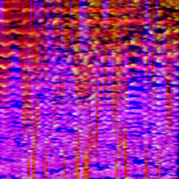

- **Definition**: A large, powerful pollinating bee known for its highly energetic flight acoustics.
- **Parameters**: `Mode: Harmonic | N_FFT: 2048 | Hop: 128 | Fmin: 100 | Fmax: 8000 | CLAHE: True`
- **Spectrogram Visually**: Dominated by intense, thick vertical bursts of bright yellow and red, crossed by smooth, glowing horizontal orange bands representing its powerful, sustained wing resonance.

#### 2. Episyrphus_balteatus (Hoverfly)

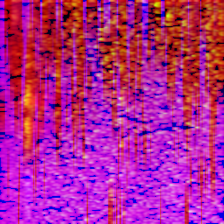

- **Definition**: A highly agile flyer with stable hovering wing mechanics that produce continuous acoustic emissions.
- **Parameters**: `Mode: Harmonic | N_FFT: 2048 | Hop: 128 | Fmin: 100 | Fmax: 8000 | CLAHE: True`
- **Spectrogram Visually**: Extremely stable and smooth. Displays continuous bright orange and yellow horizontal ribbons that slice cleanly through the darker background without chaotic interruption.

#### 3. Coccinella_septempunctata (Seven-spotted Ladybird)

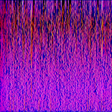

- **Definition**: An aphid-feeding beetle with intermittent movement patterns and moderate wing vibration.
- **Parameters**: `Mode: Transient | N_FFT: 512 | Hop: 32 | Fmin: 500 | Fmax: 8000 | CLAHE: True | Invert: True`
- **Spectrogram Visually**: Due to the inverted colors, it appears as a very bright, light-colored canvas marked by sharp, dark, vertical claw-marks, representing its sudden mechanical impulses and transient wing flutters.

#### 4. Aphidoletes_aphidimyza (Predatory Gall Midge)

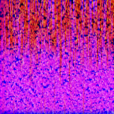

- **Definition**: A tiny predatory insect with highly active but noisy wing vibrations.
- **Parameters**: `Mode: Denoise PCEN | N_FFT: 1024 | Hop: 128 | Fmin: 500 | Fmax: 8000 | CLAHE: False`
- **Spectrogram Visually**: A chaotic, diffuse cloud of purple and magenta. Lacks strong structure, instead showing scattered, faint bright pink "static" representing its rapid but weak wingbeats.

#### 5. Bradysia_difformis (Fungus Gnat)

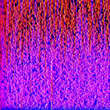

- **Definition**: A small flying insect associated with moist environments, producing weak and irregular acoustic signals.
- **Parameters**: `Mode: Denoise PCEN | N_FFT: 1024 | Hop: 128 | Fmin: 500 | Fmax: 8000 | CLAHE: False`
- **Spectrogram Visually**: A very faint, misty dark purple background with barely visible, ghostly vertical streaks of light purple and pink, showing how quiet its flight is.

#### 6. Myzus_persicae (Green Peach Aphid)

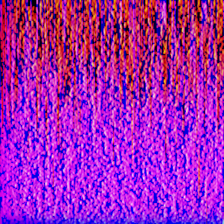

- **Definition**: A soft-bodied sap feeder with almost negligible mechanical impact and subtle movements.
- **Parameters**: `Mode: Denoise PCEN | N_FFT: 1024 | Hop: 128 | Fmin: 500 | Fmax: 8000 | CLAHE: False`
- **Spectrogram Visually**: Looks incredibly quiet. A deep, dark blue/black canvas lightly dusted with faint purple noise. Almost no bright energy peaks.

#### 7. Palomena_prasina (Green Shield Bug)

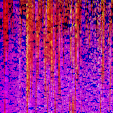

- **Definition**: A large plant-feeding bug that produces slow, heavy, substrate-induced vibrations.
- **Parameters**: `Mode: Transient Fixed | N_FFT: 768 | Hop: 48 | Fmin: 1200 | Fmax: 8000 | CLAHE: True`
- **Spectrogram Visually**: Violent and heavy. Thick, chaotic pillars of deep red and blinding yellow crash vertically down the screen, representing the heavy biomechanical thuds of its movement.

#### 8. Nezara_viridula (Southern Green Stink Bug)

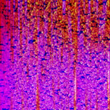

- **Definition**: A major crop pest known for heavy body vibrations and slow movement.
- **Parameters**: `Mode: Transient Fixed | N_FFT: 768 | Hop: 48 | Fmin: 1200 | Fmax: 8000 | CLAHE: True`
- **Spectrogram Visually**: Chaotic smears of bright orange and deep red spread irregularly across a noisy purple canvas. It lacks stable lines, showing unpredictable acoustic energy.

#### 9. Rhaphigaster_nebulos (Mottled Shield Bug)

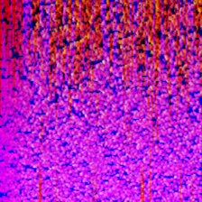

- **Definition**: A shield bug producing irregular vibrations and fragmented movement acoustics.
- **Parameters**: `Mode: Transient Fixed | N_FFT: 768 | Hop: 48 | Fmin: 1200 | Fmax: 8000 | CLAHE: True`
- **Spectrogram Visually**: Splotchy and broken. Contains fractured patches of red and unstable bright yellow streaks, showing interrupted and messy acoustic activity.

#### 10. Halyomorpha_halys (Brown Marmorated Stink Bug)

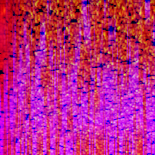

- **Definition**: A highly invasive pest with strong substrate interaction and chaotic low-frequency behavior.
- **Parameters**: `Mode: Transient Fixed | N_FFT: 768 | Hop: 48 | Fmin: 1200 | Fmax: 8000 | CLAHE: True`
- **Spectrogram Visually**: Dense, muddy, and bottom-heavy. A thick layer of red and orange noise dominates the bottom half, with erratic bright streaks shooting upwards.

#### 11. Trialeurodes_vaporariorum (Greenhouse Whitefly)

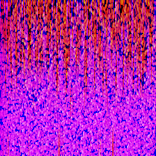

- **Definition**: A tiny greenhouse pest with rapid, repetitive micro-movements.
- **Parameters**: `Mode: Transient Fixed | N_FFT: 768 | Hop: 48 | Fmin: 1500 | Fmax: 8000 | CLAHE: False`
- **Spectrogram Visually**: A fine, static-like purple texture overlaid with very thin, highly repetitive, needle-like light-pink vertical lines.

#### 12. Tuta_absoluta (Tomato Leaf Miner)

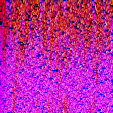

- **Definition**: A destructive larval pest producing irregular motion and boring acoustics.
- **Parameters**: `Mode: Transient Fixed | N_FFT: 768 | Hop: 48 | Fmin: 1500 | Fmax: 8000 | CLAHE: False`
- **Spectrogram Visually**: Fractured and noisy. Shows fragmented pink and light orange splashes against a dark, grainy background, representing inconsistent chewing/boring sounds.

---

### Storage Pest Species (SPID Database)

#### 13. Tenebrio (Mealworm Beetle Larvae)

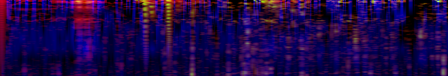

- **Definition**: A common warehouse beetle known for repetitive friction and substrate-heavy mechanical movement inside grain.
- **Parameters**: `N_FFT: 1024 | Hop: 64 | Fmin: 80 | Fmax: 6000 | Mix: [0.72, 0.28]`
- **Spectrogram Visually**: Intense vertical pillars of bright red and yellow cutting sharply through a dark blue background, caused by heavy, repetitive movement within stored products.

#### 14. Tribolium (Red Flour Beetle)

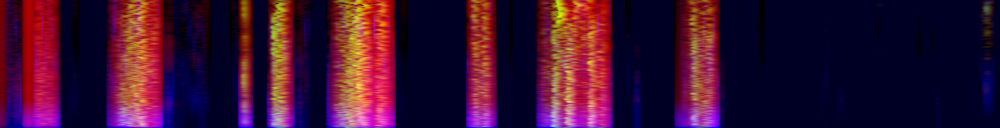

- **Definition**: A relentless grain pest producing continuous, dense interaction acoustics as it moves through flour/grain.
- **Parameters**: `N_FFT: 768 | Hop: 48 | Fmin: 1200 | Fmax: 8000 | Mix: [0.35, 0.65]`
- **Spectrogram Visually**: A highly dense, carpet-like matrix of purple and magenta, dotted heavily with tiny, repetitive orange and red specks representing endless micro-movements.

#### 15. Callosobruchus (Pulse Beetle)

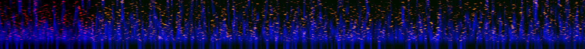

- **Definition**: A highly destructive pulse-boring pest producing extremely sharp, high-energy chewing impulses.
- **Parameters**: `N_FFT: 512 | Hop: 32 | Fmin: 3000 | Fmax: 9000 | Mix: [0.20, 0.80]`
- **Spectrogram Visually**: Very high-frequency focus. Razor-sharp red and yellow vertical lines slicing clearly against a pitch-black background, representing highly distinct, sharp chewing cracks.

## 16. No_Insect (Environmental Noise)

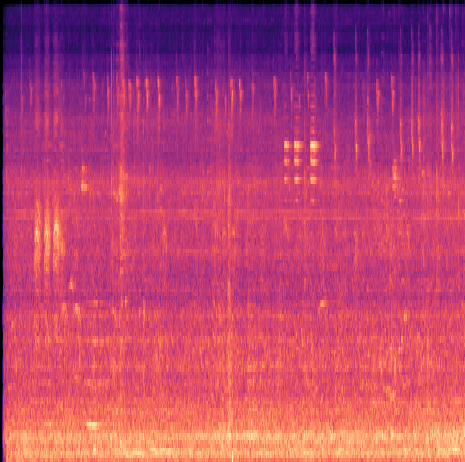

- **Definition**: The critical 'Negative Class' representing silence, wind, or mechanical warehouse noise. Crucial for open-set rejection. (Example shows natural environmental noise).
- **Parameters**: `N_FFT: 1024 | Hop: 64 | Fmin: 20 | Fmax: 8000 | Mix: [0.50, 0.50]`
- **Spectrogram Visually**: Void of sharp lines or bright colors. Appears as a washed-out, dark blue screen with faint, unstructured purple static patches.

## 19. Experiment Plots

### Archetype Family
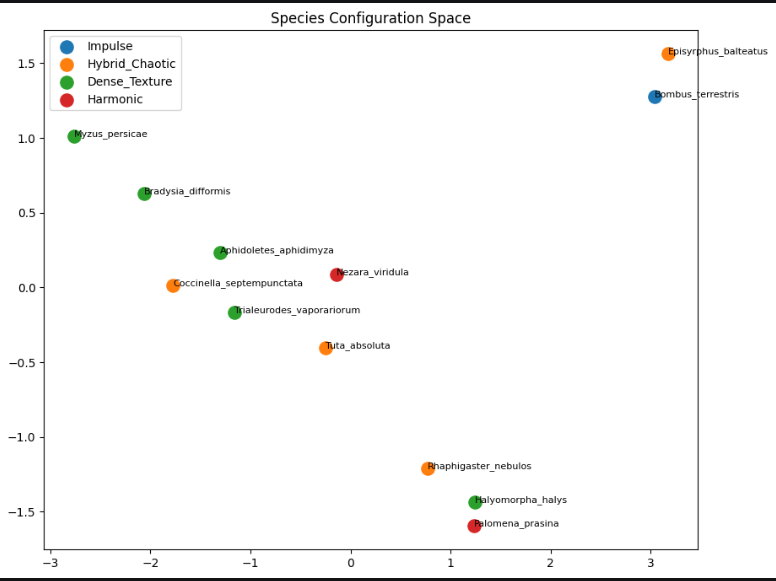
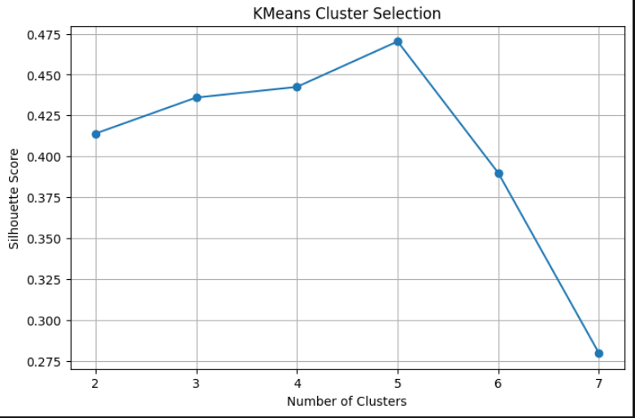
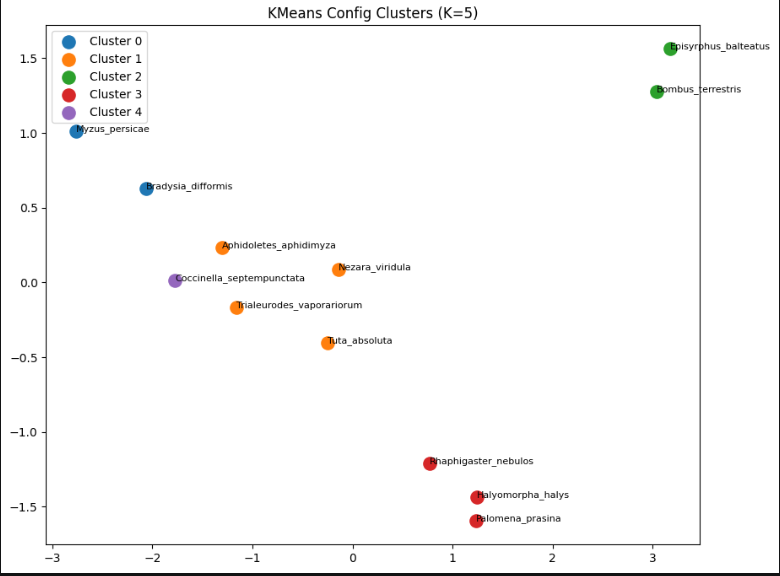

### Audio Mixing
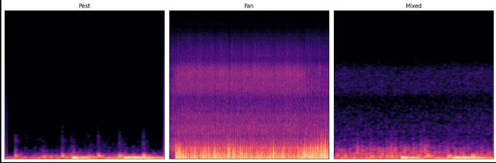
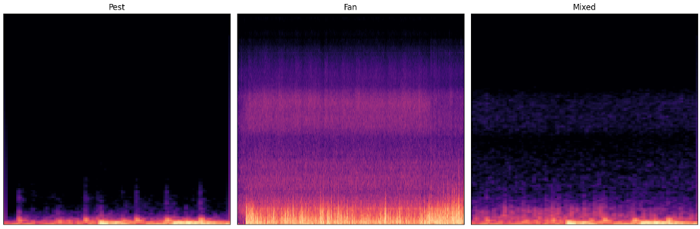
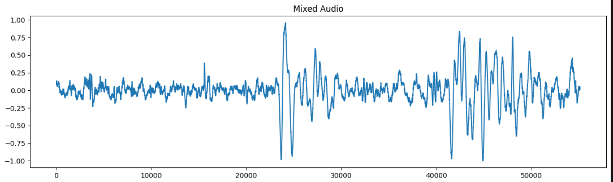
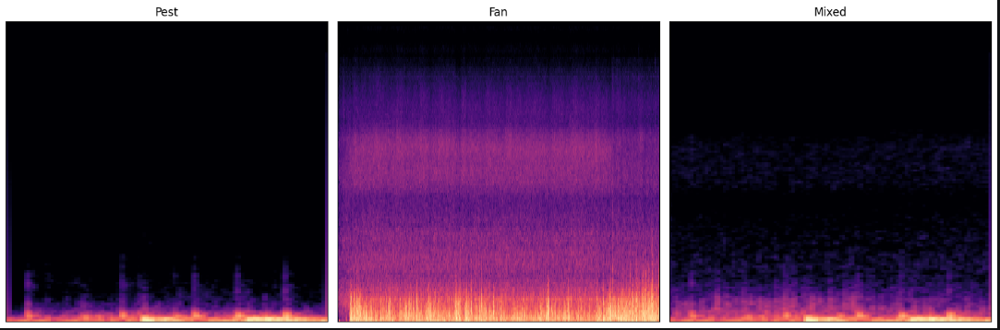
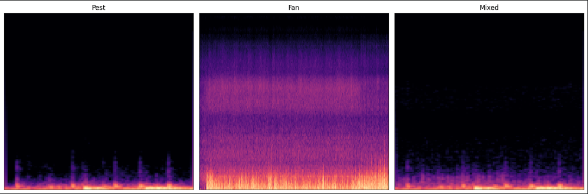
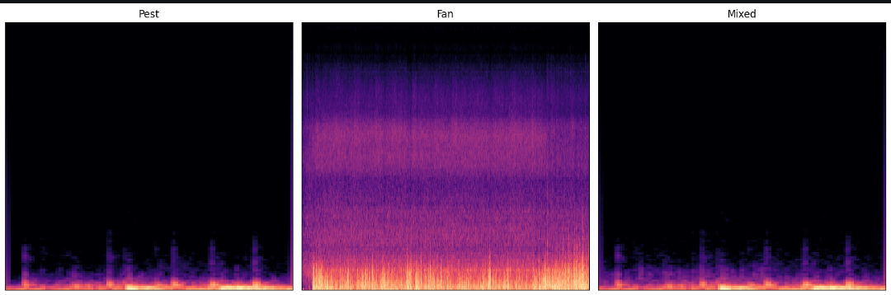
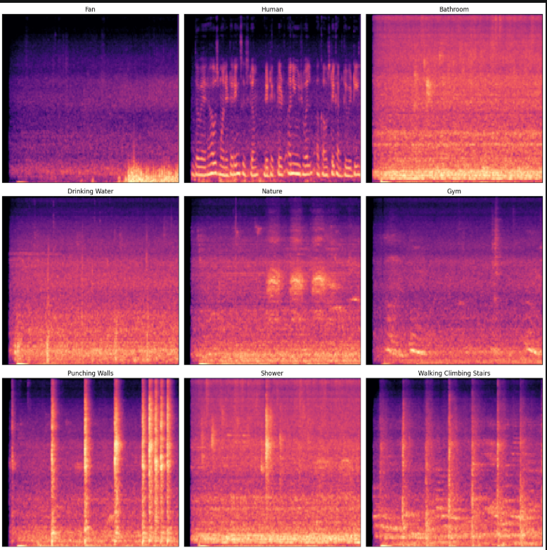


### InsectSound1000
#### EfficientNetB0


#### EfficientNetB2


#### MobileNetV2


#### MobileNetV3


##### Acoustic Family


##### Dense Texture


##### Router (Agricultural, SPID, No Insect)


##### SPID and InsectSound


### SPID
#### MobileNetV2


#### MobileNetV3


### TinyAudioCNN


### UNet Denoiser


### WavLM GMM


