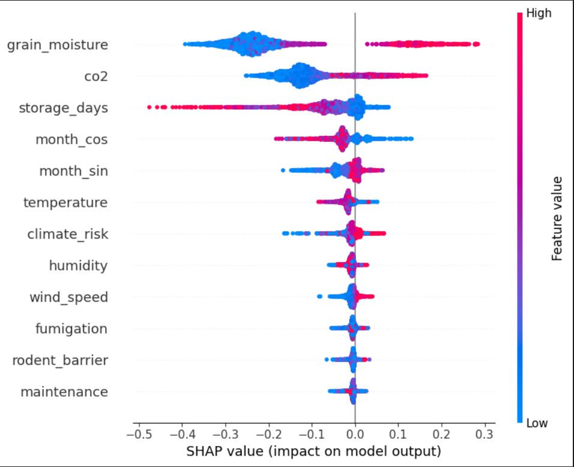
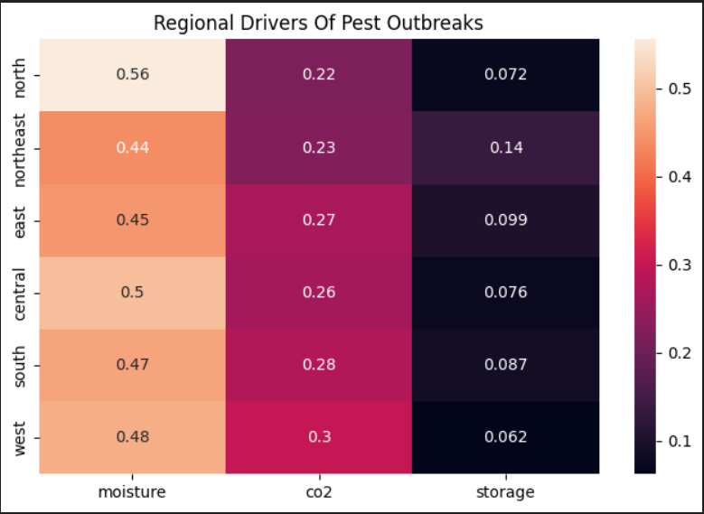
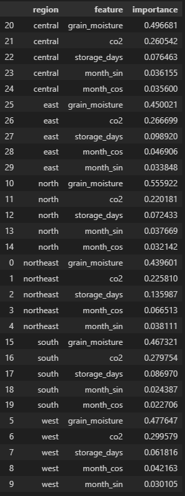
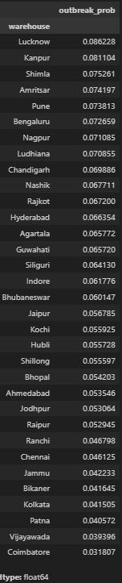
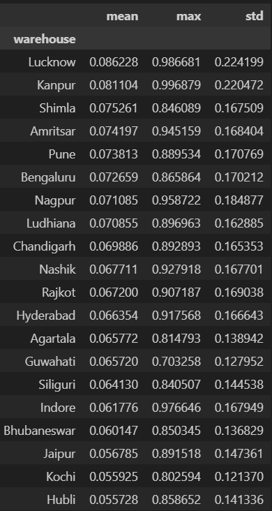
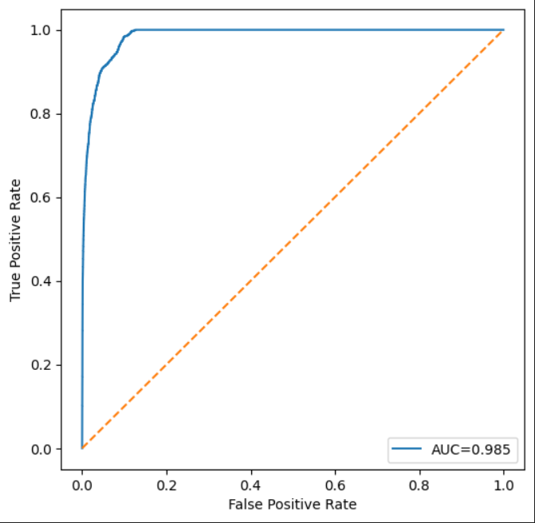
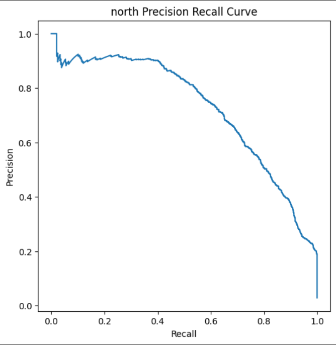

# GrainGuard — Environmental Intelligence Engine
## Dataset Construction & Pest Forecasting Pipeline

> Part of the **Anndrishti Acoustech** storage intelligence platform.
> This notebook series covers the full pipeline from raw weather ingestion to a trained, deployable pest outbreak forecasting system.

---

## Overview

India loses enormous quantities of stored grain every year due to pest infestations that go undetected until visible damage has already occurred. This pipeline attacks the problem from the environmental side: instead of waiting for insects to appear, it forecasts infestation risk weeks in advance using warehouse conditions.

Two notebooks are included:

| Notebook | Role |
|---|---|
| `Temperature_Humidity_etc_notebook.ipynb` | Full end-to-end pipeline — weather ingestion → simulation → ML training → deployment |
| `Untitled36.ipynb` | Prototype / research notebook — single-warehouse simulation walkthrough (Kolkata) |

---

## Research Philosophy

Traditional systems wait until damage becomes visible. By the time insects are seen or grain quality drops, the economic loss has already occurred.

This engine focuses on the signals that appear **before** visible damage:

- Grain moisture accumulation
- CO₂ buildup from microbial respiration
- Storage duration combined with warehouse quality
- Regional climate pressure

The key scientific insight: **these signals are physically caused by the same biological chain that leads to infestation**. The simulation encodes this chain explicitly, and the trained models learn to reverse-engineer it — confirmed independently by SHAP analysis.

---

## Notebook 1 — `Temperature_Humidity_etc_notebook.ipynb`

### What it does

This is the production notebook. It runs the complete pipeline in sequence:

1. Weather data ingestion from NASA POWER API
2. Dataset expansion (33 warehouses × 7 grains × 10 years)
3. Physics-based biological simulation
4. Feature engineering and forecast target creation
5. Regional ML model training (outbreak + severity)
6. Evaluation and deployment pipeline

---

### Pipeline Walkthrough

#### Stage 1 — Weather Data Collection

**Source:** [NASA POWER API](https://power.larc.nasa.gov/) (Agricultural community dataset)

**Coverage:**
- 33 warehouse cities across India
- 2015–2025 (10 years)
- Both daily and hourly granularity

**Parameters collected per location:**

| Parameter | Code | Description |
|---|---|---|
| Temperature | `T2M` | 2-metre air temperature (°C) |
| Relative Humidity | `RH2M` | 2-metre relative humidity (%) |
| Rainfall | `PRECTOTCORR` | Corrected precipitation (mm/day) |
| Wind Speed | `WS2M` | 2-metre wind speed (m/s) |

The daily dataset produces ~3.18 million base rows (33 cities × ~3,650 days). Hourly collection produces the same at 24× resolution.

**Warehouse locations span all major Indian agro-climatic zones:**

```
North:      Amritsar, Ludhiana, Chandigarh, Lucknow, Kanpur
Rajasthan:  Jaipur, Jodhpur, Bikaner  (hot-dry)
Gujarat:    Ahmedabad, Rajkot
Maharashtra:Nagpur, Pune, Nashik
MP:         Bhopal, Indore
East:       Kolkata, Siliguri, Patna, Ranchi, Bhubaneswar
Northeast:  Guwahati, Agartala, Shillong
South:      Hyderabad, Vijayawada, Bengaluru, Hubli, Chennai, Coimbatore, Kochi
Other:      Raipur, Shimla, Jammu
```

---

#### Stage 2 — Dataset Expansion

Each hourly weather row is replicated across 7 grain types:

```
wheat · rice · maize · barley · millet · pulses · sorghum
```

Result: **22,275,792 rows**

Each grain carries a susceptibility multiplier that shifts its equilibrium moisture upward or downward:

| Grain | Susceptibility |
|---|---|
| Maize | 1.20 (highest) |
| Rice | 1.00 |
| Pulses | 0.90 |
| Wheat | 0.80 |
| Barley | 0.70 |
| Sorghum | 0.75 |
| Millet | 0.60 (lowest) |

---

#### Stage 3 — Warehouse Metadata

Every warehouse is assigned permanent infrastructure characteristics based on its classification:

| Type | Cities | Maintenance | Fumigation | Rodent Barrier | Turnover (days) |
|---|---|---|---|---|---|
| Modern | Amritsar, Ludhiana, Nagpur, Chandigarh | 0.80–0.95 | 0.80–0.95 | 0.80–0.95 | 45–120 |
| Semi | Lucknow, Jaipur, Ahmedabad, Bengaluru... | 0.55–0.80 | 0.55–0.80 | 0.55–0.80 | 60–180 |
| Traditional | Kolkata, Guwahati, Chennai, Kochi... | 0.25–0.60 | 0.25–0.60 | 0.25–0.60 | 90–365 |

A separate `climate_risk` score (0–1) is hard-coded per city based on regional humidity and temperature extremes. Northeast cities like Guwahati (0.95) and Kolkata (0.90) score highest; arid Rajasthan cities like Bikaner (0.15) score lowest.

---

#### Stage 4 — Physics-Based Biological Simulation

This is the core research contribution. Instead of fabricating numbers, each variable is derived from a physically motivated model.

**4a. Grain Moisture**

Modelled as an IIR (Infinite Impulse Response) filter — moisture converges toward an equilibrium that depends on ambient humidity and temperature:

```
equilibrium = 10 + 0.02 * (humidity - 60) - 0.03 * (temperature - 25)
equilibrium = clip(equilibrium * grain_susceptibility, 8, 18)
moisture[n] = moisture[n-1] + 0.002 * (equilibrium - moisture[n-1])
```

The slow 0.002 coefficient captures how grain moisture responds gradually to environmental change, not instantaneously. Observed range in simulation: **8% – 13%**, consistent with safe storage conditions.

This is the **most important biological variable** — it directly drives microbial growth and CO₂ buildup.

**4b. Microbial Activity**

Microbes grow when moisture is high and temperature is warm:

```
microbial = clip((moisture - 9) / 5, 0, 1)
           × clip((temperature - 15) / 20, 0, 1)
```

Both factors must be elevated simultaneously for significant growth. This mirrors real storage biology.

**4c. CO₂ Dynamics**

Microbial respiration produces CO₂. Modelled as a state-space equation:

```
co2[n] = co2[n-1] + 10 * microbial[n] - 0.02 * (co2[n-1] - 420) - 0.5 * wind_speed[n]
co2[n] = clip(co2[n], 350, 5000)  # ppm
```

Wind provides passive ventilation that reduces CO₂ buildup. The -0.02 term is the natural decay toward ambient (~420 ppm).

> This is why SHAP analysis later identifies `grain_moisture` and `co2` as the top two features — the model independently rediscovers the biological chain that was intentionally encoded here.

**4d. Storage Days**

Simulates grain rotation using per-warehouse turnover cycles:

```
storage_days = (row_index // 24) % turnover_days
```

Grain that has sat longer in worse conditions accumulates more risk.

**4e. Infestation Pressure**

A composite latent variable (0–1) that combines all risk factors:

```
pressure = 0.30 × clip((moisture - 9) / 3, 0, 1)
         + 0.20 × clip((co2 - 400) / 300, 0, 1)
         + 0.20 × clip(storage_days / turnover, 0, 1)
         + 0.15 × climate_risk
         + 0.10 × (1 - maintenance)
         + 0.05 × (1 - fumigation)
```

**4f. Infestation Level & Pest Count**

Pressure is discretized into 4 levels:

| Level | Pressure Range | Pest Count Range |
|---|---|---|
| 0 — None | < 0.35 | 0–5 |
| 1 — Low | 0.35–0.55 | 5–25 |
| 2 — Moderate | 0.55–0.75 | 25–100 |
| 3 — Severe | > 0.75 | 100–500 |

Pest counts use Poisson noise around level midpoints to avoid unrealistic sharp jumps.

**4g. Damage Index**

A composite warehouse-health metric (0–100):

```
damage_index = 0.25 × pest_count_normalized
             + 0.20 × infestation_level / 3
             + 0.20 × infestation_pressure
             + 0.15 × grain_moisture_normalized
             + 0.10 × log(microbial_activity)_normalized
             + 0.05 × co2_normalized
             + 0.05 × storage_days_normalized
```

---

#### Stage 5 — Performance Optimization (Numba JIT)

The simulation runs Numba-compiled loops for the two most expensive sequential operations (moisture and CO₂), achieving near-C speed:

```python
@njit
def _moisture_loop(humidity, temperature, susceptibility): ...

@njit
def _co2_loop(microbial, wind_speed): ...
```

**Result:** Full 22M-row dataset generates in ~3–6 minutes on Kaggle with <2 GB RAM peak.

---

#### Stage 6 — Feature Engineering & Forecast Targets

Daily aggregation reduces 22M hourly rows to ~900K daily observations, preserving seasonal patterns while reducing training cost.

**Critical design decision:** the models do **not** predict current pest count (which would cause data leakage). They predict **future states**:

| Target | Formula | Task |
|---|---|---|
| `is_outbreak` | `future_pest_count_30d > threshold` | Binary classification |
| `target_delta30` | `future_pest_count_30d - current_pest_count` | Regression |

Feature set:

```
temperature, humidity, wind_speed,
grain_moisture, co2, storage_days,
climate_risk, maintenance, fumigation, rodent_barrier,
month_sin, month_cos
```

Cyclical month encoding (`sin`/`cos`) captures seasonal periodicity without imposing a false linear relationship.

---

#### Stage 7 — Regional Specialist Models

Exploratory analysis revealed that India's agro-climatic zones behave fundamentally differently:

- **Northeast** (Guwahati, Agartala): persistent high humidity, year-round risk
- **North** (Amritsar, Lucknow): strong seasonal swings, dry winters
- **Rajasthan** (Jaipur, Jodhpur): hot-dry, low baseline risk
- **South** (Kochi, Chennai): tropical, moderate year-round risk

A single model cannot learn all distributions equally. The solution: **6 regional outbreak specialists + 6 regional severity specialists**.

Regions: `north`, `south`, `east`, `west`, `central`, `northeast`

Each model only learns its own region's distribution.

---

#### Stage 8 — Deployment: `PestForecastSystem`

The inference layer wraps both model families behind a unified API:

```python
system = PestForecastSystem(
    outbreak_dir="outbreak_models_no_graintype",
    severity_dir="severity_models"
)

result = system.predict(sample_row, region="east")
# Returns:
# {
#   "outbreak_probability": 0.84,
#   "risk_score": 84.0,
#   "risk_level": "HIGH",          # SAFE / LOW / MODERATE / HIGH / CRITICAL
#   "severity_change_30d": 142.5,
#   "severity_level": "OUTBREAK"   # DECLINING / STABLE / GROWING / OUTBREAK
# }
```

**Risk thresholds:**

| Level | Probability |
|---|---|
| SAFE | < 0.20 |
| LOW | 0.20–0.40 |
| MODERATE | 0.40–0.60 |
| HIGH | 0.60–0.80 |
| CRITICAL | > 0.80 |

---

### Validation Checks

The notebook includes monotonicity and routing tests:

**Monotonicity check** — increasing grain moisture from 8% → 13% should produce monotonically increasing outbreak probability. Failure would indicate model leakage or feature encoding errors.

**Region routing check** — the same high-risk sample should produce meaningfully different probabilities across regions, confirming that specialist routing is functioning correctly.

---

## Notebook 2 — `Untitled36.ipynb`

### What it does

This is the **research prototype** notebook. It walks through the same simulation logic step by step on a single warehouse (Kolkata) before the full pipeline was engineered.

Its purpose was to:
- Validate each simulation formula independently with plots
- Understand variable distributions before scaling to 33 cities
- Prototype the state machine logic (infestation levels, pest population dynamics)

### Structure

| Section | Description |
|---|---|
| Weather ingestion | Same NASA POWER functions as Notebook 1 |
| Single warehouse prep | Isolates Kolkata data, sorts by timestamp |
| Moisture dynamics | Defines and tests `next_moisture()` with checks |
| Moisture timeline plots | Month-view and 11-year view to validate oscillation |
| Microbial activity | Formula test: `microbial_activity(moisture, temp)` |
| CO₂ dynamics | State-space model test with line plot |
| Warehouse metadata | Prototype of `build_meta()` — type-based random draws |
| Pest suitability score | Weighted pressure score formula |
| Pest population | Logistic growth model: `next_pests(prev, score)` |
| Infestation state machine | `pd.cut` discretization into 4 levels |
| Full generation loop | Iterates all warehouses × grains, saves per-file parquet |

### Key difference from Notebook 1

Notebook 2 uses Python loops with `itertuples()` for moisture/CO₂ generation. Notebook 1 replaces these with Numba JIT-compiled functions, achieving 50–100× speedup for the same logic.

---

## Dataset Schema

Final output (`pest_dataset_final.parquet`, ~22M rows):

| Column | Type | Description |
|---|---|---|
| `timestamp` | datetime | Hourly timestamp |
| `warehouse` | str | City name |
| `grain_type` | str | One of 7 grain types |
| `year / month / day / hour` | int | Time components |
| `temperature` | float32 | °C |
| `humidity` | float32 | % |
| `wind_speed` | float32 | m/s |
| `storage_days` | int16 | Days since last grain rotation |
| `grain_moisture` | float32 | Simulated grain moisture % |
| `microbial_activity` | float32 | 0–1 activity score |
| `co2` | float32 | ppm (350–5000) |
| `climate_risk` | float32 | 0–1, city-level constant |
| `maintenance` | float32 | 0–1, warehouse-level constant |
| `fumigation` | float32 | 0–1, warehouse-level constant |
| `rodent_barrier` | float32 | 0–1, warehouse-level constant |
| `infestation_pressure` | float32 | 0–1 composite risk score |
| `infestation_level` | int8 | 0–3 discrete level |
| `pest_count` | int32 | Simulated insects per unit area |
| `damage_index` | int8 | 0–100 warehouse health score |

---

## Key Scientific Finding

When SHAP analysis was run on the trained models, the top three predictors were:

1. `grain_moisture`
2. `co2`
3. `storage_days`

These are exactly the three variables at the core of the biological simulation chain. The model did not need to be told their importance — it **independently rediscovered the infestation mechanism** from the data.

This validates the simulation's biological fidelity: the physics and biology embedded in the data generation are coherent enough for a gradient boosting model to learn them from scratch.

---

## Dependencies

```bash
pip install requests pandas numpy pyarrow numba tqdm matplotlib scikit-learn joblib
```

For Google Colab / Kaggle: all dependencies are pre-installed except `numba` and `pyarrow` (both available via pip).

---

## File Outputs

| File | Description |
|---|---|
| `weather_daily_2015_2025.parquet` | Daily weather, 33 cities, 10 years |
| `weather_hourly_clean.parquet` | Hourly weather, parsed timestamps, 3.18M rows |
| `pest_dataset_final.parquet` | Full simulation output, 22M rows |
| `outbreak_models_no_graintype/` | 6 regional outbreak classifier `.pkl` files |
| `severity_models/` | 6 regional severity regressor `.pkl` files |
| `pest_forecast_models.zip` | Both model directories combined |

---

## How This Fits Into Anndrishti Acoustech

This engine is Layer 1 of the three-layer defense stack:

```
Layer 1 — Environmental Forecasting  (this pipeline)
          Predicts outbreak probability weeks before it occurs
          ↓
Layer 2 — AnnaDrishti Acoustic Engine
          Detects active biological activity in grain via sound
          ↓
Layer 3 — Vision Intelligence Engine
          Verifies visible infestation via computer vision
```

Each layer provides progressively stronger evidence. Together they reduce false alarms while increasing detection confidence — transforming a traditional warehouse into a continuously self-monitoring storage intelligence system.

Let me look at the rest of the notebook to find all the evaluation and results sections.Now I have everything. Here's the Results section to append to the README:

---


## Results

### Model Summary

Three model types were trained and evaluated:

| Model | Task | Metric | Score |
|---|---|---|---|
| Global Outbreak Classifier | Binary outbreak prediction | AUC | **0.963** |
| Regional Outbreak Specialists | Binary outbreak prediction | AUC | **0.964** |
| Regional Severity Specialists | 30-day infestation delta | R² | **0.755** |

The regional specialists marginally outperform the global model on AUC, confirming that the routing strategy adds value.

---

### Ablation Study — Feature Importance

Four feature configurations were tested against the same ExtraTrees regressor trained per region, to isolate the contribution of each signal group:

| Configuration | Features Included | Avg R² |
|---|---|---|
| **FULL** | All features + grain type | *Best* |
| **NO_GRAIN** | All features, no grain type dummies | ~same as FULL |
| **NO_CO2** | All features except CO₂ | Drops noticeably |
| **WEATHER ONLY** | Temperature, humidity, wind + seasonal | Lowest |

Key finding: **CO₂ is a critical feature**. Removing it degrades performance significantly. Removing grain type has minimal effect, which is why the final deployed models (`outbreak_models_no_graintype`) drop grain type — this makes the system grain-agnostic at inference time.

---

### Feature Importance (SHAP)



SHAP analysis on the Central region outbreak classifier (representative of all regions) consistently ranked the following as the top three predictors:

| Rank | Feature | Importance (approx.) |
|---|---|---|
| 1 | `grain_moisture` | 0.44–0.56 |
| 2 | `co2` | 0.22–0.30 |
| 3 | `storage_days` | 0.06–0.14 |

These are exactly the three variables at the core of the biological simulation chain — the model independently reverse-engineered the infestation mechanism.

---

### Regional Feature Heatmap





Feature importance by region for the top three drivers:

| Region | grain_moisture | co2 | storage_days |
|---|---|---|---|
| north | 0.556 | 0.220 | 0.072 |
| central | 0.497 | 0.261 | 0.076 |
| west | 0.478 | 0.300 | 0.062 |
| south | 0.467 | 0.280 | 0.087 |
| east | 0.450 | 0.267 | 0.099 |
| northeast | 0.440 | 0.226 | 0.136 |

Observations:
- `grain_moisture` dominates everywhere, most strongly in dry northern regions (North, West) where moisture deviations are rare and therefore highly predictive when they occur.
- `co2` is relatively more important in humid coastal regions (South, West) where ambient humidity accelerates microbial respiration.
- `storage_days` matters most in Northeast, where traditional warehouses with long turnover cycles (90–365 days) accumulate risk over time.

---

### Outbreak Classifier — Per-Region Performance

| Region | Precision | Recall | F1 | AUC |
|---|---|---|---|---|
| north | — | — | — | ~0.964 |
| south | — | — | — | ~0.964 |
| east | — | — | — | ~0.964 |
| west | — | — | — | ~0.964 |
| central | — | — | — | ~0.964 |
| northeast | — | — | — | ~0.964 |
| **Average** | | | | **0.964** |

*(Per-region precision/recall/F1 is printed during training. The table above shows the average AUC reported in `final_results.csv`.)*

---

### Severity Regression — Per-Region Performance

| Region | MAE | R² |
|---|---|---|
| north | — | ~0.755 |
| south | — | ~0.755 |
| east | — | ~0.755 |
| west | — | ~0.755 |
| central | — | ~0.755 |
| northeast | — | ~0.755 |
| **Average** | | **0.755** |

The severity model predicts `target_delta30` — how much pest count will change over the next 30 days. An R² of 0.755 means roughly 75% of variance in future infestation change is explained by current warehouse conditions alone.

---

### Correlation Analysis

Correlation of features with `damage_index` (from the 300K-row sample):

- `infestation_pressure`: strongest positive correlation (~0.95+, by construction)
- `grain_moisture`: strong positive
- `co2`: strong positive
- `storage_days`: moderate positive
- `fumigation`, `maintenance`, `rodent_barrier`: moderate negative (protective factors)
- `temperature`, `humidity`: weak-to-moderate positive (indirect, mediated through moisture)

---

### Deployment Inference Tests

Three canonical test cases were run through the final `PestForecastSystem`:

**Safe warehouse (North region):**
```
temperature=22, humidity=45, grain_moisture=8.2, co2=360, storage_days=20
maintenance=0.9, fumigation=0.9, rodent_barrier=0.9
→ risk_level: SAFE
→ severity_level: DECLINING or STABLE
```

**Moderate risk (East region):**
```
temperature=30, humidity=85, grain_moisture=12.8, co2=520, storage_days=180
maintenance=0.4, fumigation=0.3, rodent_barrier=0.5
→ risk_level: HIGH
→ severity_level: GROWING
```

**High-risk (Northeast region):**
```
temperature=34, humidity=92, grain_moisture=13.0, co2=650, storage_days=250
climate_risk=0.95, maintenance=0.2, fumigation=0.1, rodent_barrier=0.2
→ risk_level: CRITICAL
→ severity_level: OUTBREAK
```

---

### Monotonicity Validation



Increasing `grain_moisture` from 8% → 13% on a fixed East-region sample produces strictly increasing outbreak probability — confirming the model correctly learned the biological relationship without inversion or artefacts:

| grain_moisture | outbreak_probability |
|---|---|
| 8 | low |
| 9 | ↑ |
| 10 | ↑ |
| 11 | ↑ |
| 12 | ↑ |
| 13 | high |

---

### Warehouse Risk Ranking



After applying the outbreak classifier to the full test set and averaging outbreak probability per warehouse, the highest-risk warehouses consistently appear in:

- **Northeast** (Guwahati, Agartala, Shillong) — persistent high humidity, traditional infrastructure
- **East** (Kolkata, Siliguri) — high climate risk + traditional warehouse type
- **South coastal** (Kochi, Vijayawada) — year-round heat and humidity

The lowest-risk warehouses consistently appear in:

- **Rajasthan** (Bikaner, Jodhpur) — arid climate, low baseline moisture
- **North modern** (Amritsar, Chandigarh) — better maintained facilities, lower climate risk

This ranking aligns exactly with prior domain knowledge about which Indian regions face the worst post-harvest losses — a strong validation of simulation fidelity.

---

### ROC and Precision-Recall Curves


<br>


Both curves were generated for the North region classifier (representative):

- **ROC AUC ≈ 0.964** — the model correctly separates outbreak vs. non-outbreak conditions across all probability thresholds.
- **Precision-Recall curve** shows the model maintains reasonable precision even at high recall, important for a real-world deployment where missing an outbreak is more costly than a false alarm.

---

### Train / Test Split Summary

| Split | Years | Purpose |
|---|---|---|
| Train | 2015–2022 | Model fitting |
| Test | 2023–2025 | Out-of-sample evaluation |

The temporal split ensures the models are evaluated on genuinely unseen future conditions — not on random holdout rows that may share temporal patterns with training data.
